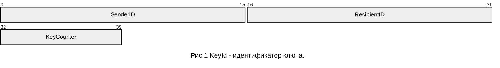
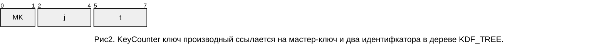

# Протокол управления и сбора данных #

Автор:
* __[Анатолий Георгиевский](https://github.com/AnatolyGeorgievski)__


Типы обмена бывают: 
```
.subscribe 	- (list) подписка на события, 
.notify 	- уведомления от сервера - команды и сообщения без подтверждения, 
.submit 	- (отсылка результатов, publish), 
.authorize, .configure, 
.create - (oid; params)  -- создание объекта
.delete   (oid)          -- удалить объект
.add_list (oid, pos; params), -- добавить элемент списка
.remove_list(oid, pos),  -- удалить из списка элемент
.set	(obj;params),    -- установка параметров объекта
.get	(obj;params),    -- запрос параметров объекта
.range	(obj, pos, len), -- чтение списка
```

В качестве примера рассмотрим типы сервисов с подтверждением, протокол BACnet для автоматизации зданий:
```c
const char* confirmed_services[]={ // названия сервисов BACnet с подтверждением
[ 0]= "acknowledge-alarm (0)",
[ 1]= "confirmed-cov-notification (1)",
[ 2]= "confirmed-event-notification (2)",
[ 3]= "get-alarm-summary (3)",
[ 4]= "get-enrollment-summary (4)",
[ 5]= "subscribe-cov (5)",
/// File Access Services
[ 6]= "atomic-read-file (6)",
[ 7]= "atomic-write-file (7)",
/// Object Access Services:
[ 8]= "add-list-element (8)",
[ 9]= "remove-list-element (9)",
[10]= "create-object (10)",
[11]= "delete-object (11)",
[12]= "read-property (12)",
[14]= "read-property-multiple (14)",
[15]= "write-property (15)",
};
```
Формальное описание протокола надо свести к табличному описанию типов полей, на языке описания данных. Описание структур данных, и моделей взаимодействия протокола составляет дисциплину - моделирование данных. 
Так выглядит описание полей и идентификаторов на языке Си:
```c
#define HBOARD_NS \
	_(asic),_(chips),_(cols),_(sens),_(baud),_(tfreq),\
	_(hrate),_(perf),_(effi),_(freq),_(temp),_(tune)
#define _(x) HBOARD_##x
enum {HBOARD_NS, HBOARD_COUNT};
static const ObjectProperty_t _hboard[HBOARD_COUNT] = {
[_(asic)]	={T(UINT),	OF(Board_t, asic_id),		.read_only=1},
[_(chips)]	={T(UINT),	OF(Board_t, chain_length),	.read_only=1},
[_(cols)]	={T(UINT),	OF(Board_t, chain_cols),	.read_only=1},
[_(sens)]	={T(UINT),	OF(Board_t, num_sensors),	.read_only=1},
[_(hrate)]	={T(REAL),	OF(Board_t, hashrate)		},//!< число хешей в секунду
[_(perf)]	={T(REAL),	OF(Board_t, perfomance)		},//!< число хешей на гигагерц
[_(effi)]	={T(REAL),	OF(Board_t, efficiency)		},//!< энергоэффективность
[_(freq)]	={T(REAL),	OF(Board_t, frequency)		},//!< тактовая частота, текущая
[_(temp)]	={T(REAL),	OF(Board_t, temperature)	},//!< средняя температура
[_(tune)]=	{ARRAY_OF(SINT8),OF(Board_t, freq_adjust)},
};
```
При описании используются различные сокращения и препроцессорная обработка. Например, определение '_(x)' формирует идентификатор поля - порядковый номер в перечислении. Определение OF - формирует смещение поля внутри структуры. 
Мы можем ввести некоторый мета-язык удобный для описания данных вне языков программирования и из него синтезировать подобные определения автоматически. Надо понимать, что протокол прикладного уровня описывает объекты, отладка и изменение свойств объекта вызывает изменения минимум в трех местах: непосредственно в датчике, где рождаются данные, в устройстве сбора данных, где выполняется промежуточное хранение и упаковка в транспортный протокол, в "облачном" сервисе который обеспечивает доступ, в клиентском приложении для отображения данных, в системе мониторинга. Изменение состава свойств и методов объекта влечет за собой изменения в структурах данных и коде в соответствующих службах и приложениях. Нам нужно таким образом описывать свойства чтобы все сетевые службы и приложения, которые участвуют в обмене воспринимали описание модели, чтобы синтез структур данных для обработки выполнялся по правилам, описанным в модели.

Кроме описания свойств объекта, есть описание интерфейсов и описание класса объекта, которое также синтезируется из модели. Класс может включать методы - конструкторы, деструкторы и метод уведомления - доставки событий. 
```c
#define _(x) #x
static const ObjectClass_t _hboard_cl = {
	.rt  = RT(brd), .ns = (const char*[]){HBOARD_NS}, 
	.rep =_hboard,
};
```
В составе объекта присутствует
- тип ресурса (rt)
- пространство имен (ns)
- внешнее представление (rep)
- политики взаимодействия (p), соответствуют наборами свойств:
  + содержит привязку к классу и наблюдаемым параметрам (discoverable) 
  + отслеживает и публикует список параметров (observable)
  + является получателем уведомлений NOTIFY (pushable). 

Политика discoverable означает, что объект приводится к классу Resource и к нему могут применяться методы настройки и опроса параметров, такие как get_params, set_params.
Политика observable допускает подписку на свойства объекта. Политика pushable - объект поддерживает механизм доставки уведомлений о событиях. 

Еще в коде присутствуют статические конструкторы и деструкторы для классов и объектов управления которые выполняют регистрацию классов в системе. 
```c
static void __attribute__((constructor)) _object_type_init();
static void __attribute__((destructor))  _object_type_fini();
```
Подобные структуры данных могут синтезироваться из модели автоматически, вместе с описанием интерфейсов и конструкторами классов. 

## Общие требования ##

При обмене запрос-ответ применяется адресация объектов через идентификатор объекта OID. 

**Глобальный идентификатор OID** представляет собой путь от корня директории с разделителями '.'. Путь может содержать имена и числовые (контекстные) идентификаторы. Глобальные идентификаторы начинаются с разделителя.

**Локальный идентификатор OID** формируется из сокращенного имени типа ресурса (`rt`, resource type) и порядкового номера (`ins`) "brd@1" "dev@0" через разделитель '@'. 
Запись "pool" - номер не определен, - такая форма используется при создании объекта. 
В ответе передается идентификатор созданного объекта в форме OID.

**Контекстные идентификаторы**. При адресации параметров используются последовательности идентификаторов состоящие из перечисления имен параметров и/или из перечисления позиционных(контекстных) идентификаторов и индексов структур. Позиционные идентификаторы параметров нумеруются от единицы (1). Позиционный идентификатор (0) адресует всю структуру. Адресация таким образом задается относительно локального идентификатора объекта. Последовательность позиционных идентификаторов кодируется, как (sdnv, Self-Delimiting Numeric Values) - числовые последовательности со встроенными разделителями. Список параметров, передаваемый в запросе, может быть представлен именами, контекстными идентификаторами(sdnv) и числами. 

В том случае, когда имя параметра запроса, передаваемого в форме строки, содержит число в первом байте - это число интерпретируется, как байтовая, строка содержащая кодовую последовательность _BSTR_SDNV. Идентификаторы текстовые напротив не могут содержать число в первом символе имени. 

Команды бывают запрос-ответ (GET, PUT), и уведомления от устройства (NOTIFY). Чтобы получать пакеты уведомления, нужна подписка. Подписка существует в рамках протокола MQTT и CoAP. В протоколе CoAP подписка действует в течение сессии. Подписка инициируется опцией observe в пакете типа GET.Observe. Запрос должен содержать уникальный номер запроса, токен (id), который возвращается с ответом. 

Локальные имена типов ресурсов (`rt`) должны состоять из трех или четырех букв (сокращенное имя). Это искусственное ограничение применяется ради упрощения процедуры сопоставления имен, см. соглашение о сокращенных именах. Фактически мы говорим о сопоставлении локальных и глобальных идентификаторов типов ресурсов. Список таких сокращений - свойство устройства. В процессе распознавания устройств, мы можем запросить список используемых локальных идентификаторов ресурсов `rts`.

Мы резервируем множество сокращенных идентификаторов `rts` для обозначения классов устройств:
```c
const char* _object_names[] = {
ID(any),ID(adc),ID(brd),ID(bus),ID(can),ID(cpu),ID(dac),ID(dev),ID(dir),ID(fan),ID(file),ID(gpio),ID(i2c),
ID(lnk),ID(net),ID(shm),ID(spi),ID(tty),ID(uart),ID(usb),ID(psu),ID(pwm),ID(tim)
};
```

Маршрутизация запросов основана на коллекциях ресурсов. Устройство может поддерживать несколько сетей и выполнять маршрутизацию запросов между сетями. Объект типа network или bus экспортирует множество адресуемых устройств. Полный путь к устройству может быть составным "/dev/net@1/dev@101/brd@1" или "/dev/usb@1/i2c@1/mem@21" или "/dev/i2c@1/lm75@80"... Путь uri_path может содержать локальные идентификаторы или имена устройств. Ресурсы обладающие свойством discoverable имеют локальный идентификатор в форме {\$rt@nn} и имя уникальное в коллекции {\$n}. 


Каждый объект в коллекциях должен экспортировать свойства: oid, name. Корневой объект "dev@0" должен иметь уникальное имя в сети, и уникальный серийный номер `ins`. Каждый объект должен иметь список доступных параметров `rts`, из которого выделяется  обязательный набор `rts-m` для целостности запросов и полноты ответов выбранного интерфейса взаимодействия с объектом (`if`). 

Мы предусматриваем процедуру развертывания сети устройств, которая предполагает отсылку уведомлений о присутствии в локальной сети. И возможность назначения конфигурации `config` по уникальному идентификатору `ins`. Автоматическую процедуру обновления прошивок `firmware` устройств. 


## Сетевая модель ##

Класс `bus` экспортирует коллекцию устройств с возможностью адресации по `ins` - уникальному адресу на линии.

Класс `usb` экспортирует с возможностью выборки по "PID=&VID=" и ins={Serial}. Серийный или порядковый номер попадает в `ins`. "Экспорт" - это интерфейс взаимодействия с устройством, который позволяет создать ресурс по параметрам запроса 
```js
{path:"/dev", port:"PID=&VID=", ins:"...", config="..."}
```

Запись `port:"PID=...&VID=..."` эквивалентна `port:{PID:"...",VID:"..."}`. Формат записи соответствует TSTR_URI_QUERY. Для каждого типа драйвера линии сбора данных набор параметров может быть свой.
Так например, Запись `port:"baudrate=115740&stopbits=2&gpio_rst=119"` в формате TSTR_URI_QUERY применяется для создания устройства на линии UART `type:"tty"`.

Ресурс типа `type:"i2c"` экспортирует устройства различного типа с привязкой по адресу. Поддерживает интерфейс Gateway. 

Ресурс типа `type:"can"` экспортирует устройства по адресам и именам блоков BU и номерам сетевых объектов BO согласно схеме. Коллекция будет содержать сетевые устройства, блоки и сетевые объекты. Схему можно импортировать в формате [SAE J1939 DBC].

Ресурс типа `type:"reg"` экспортирует файлы из директории устройства. Объектный идентификатор файла составляется из `rt` и `ins`.

Ресурс типа `type:"lnk"` содержит символьную ссылку.

Класс `net` экспортирует коллекцию обнаруженных адресов устройств, каждому устройству сопоставляется `ins` и `ep`(endpoint) proxy_uri или список альтернативных способов с разными схемами взаимодействия `{proxy_schema '://' proxy_uri}`, альтернативные адреса сопровождаются параметрами `priority` и `latency`, параметром `content-format`. В сети может быть выделенное устройство, которое поддерживает функцию *Proxy*, *Gateway* и функцию *Router*. Сетевое устройство может поддерживать несколько сетей и для каждой определять набор функций и список `eps` (endpoints). Сети идентифицируются по номеру `ins`. Полный путь для методов протокола относительно данного устройства может содержать два и более элемента в перечислении `/dev/net@1/dev@2/..`

Если мы рассматриваем организацию сети в модели "умный дом", то надо представлять одну или несколько сетей LAN, таких как WiFi или Ethernet, одну и более сетей сбора данных для подключения датчиков и исполнительных устройств, один "облачный" WAN сервис TCP c функцией перенаправления запросов (*Proxy*) к устройству сбора данных в локальной сети. Устройство в свою очередь должно поддерживать кеширование данных и обладать функцией *Gateway* для линий сбора данных датчиков. 

Существует еще одна выделенная роль *KeyServer*, которая поддерживает функции: обмена ключами между устройствами, назначение адресов, раздачу конфигурационных файлов и бинарных прошивок, обеспечивает развертывание сети и замену оборудования. В сети поддерживается возможность публикации уведомлений и подписки на уведомления. 

Если мы рассматриваем модель "контейнер с оборудованием", он будет включать множество устройств, не имеющих прямого выхода во внешнюю сеть. Устройства подписываются на рассылку заданий. Выделенное устройство, которые выполняет роль устройства сбора данных, записывает журнал и поддерживает распознавание сети, поддерживает функцию *Proxy* и *Router*. Выделенное устройство обеспечивает доступ к сети сбора данных: CAN, LIN, I2C, SMBus/PMBus, RS-485, для управления различными параметрами окружения и параметрами размещения оборудования: отоплением, охлаждением, вентиляцией, электрикой, освещением, контролем доступа; распределение, планирование и учет ресурсов на основе критериев энергоэффективность, производительность и т.п. Контейнер поддерживает секционирование, как способ структуризации и организации оборудования. 

В модели "мобильный контейнер" добавится блок GNSS на линии CAN для навигации и глобального позиционирования. 

Протокол сбора данных прикладного уровня описывается абстрактно в терминах {request,response,confirm,indication} с использованием списка параметров запроса `params` и параметров протокола (`id`, `if`, `rt`, `ins`, `n`, `oid`, `range` и т.п.), без привязки к схеме взаимодействия и сетевому протоколу. Сервисы протокола работают в разных режимах, с подтверждением получения {`CREATE`, `RETRIEVE`, `UPDATE`, `DELETE`} или без подтверждения {`PUBLISH`, `NOTIFY`}. Методы `PUBLISH` могут относится к одному устройству или к группе получателей. В рамках данной модели может поддерживаться несколько протоколов, выбор протокола определяется компонентой `uri_schema` сетевого пути, например "coap+tcp", "coap+ws", "mqtt", "http". 

## Инициализация и развертывание ##

Начальная инициализация выполняется с использование конфигурационных файлов в формате Json (см. [config.json](config.json)).  Файл содержит перечисление объектов и списков объектов. 

Ресурс типа `type:"i2c"` и `type:"i2c_gpio"` инициализируется с использованием параметров назначения линий ввода вывода `port:[ 2, 3]` или `port:{sda:2, scl:3}` или `port:"sda=2&scl=3"` все три варианта записи эквивалентны.

Ресурс типа `type:"spi"` использует параметры инициализации порта `port:"mosi=2&miso=3&clk=4&ce=5&polariy=..."`

Ресурс типа `type:"gpio"` позволяют экспортировать параллельный порт с набором линий. Набор линий задается через перечисление номеров линий относящихся к устройству `path:"/dev/gpiochipN", port:[...]`. При опросе порта маска будет содержать биты в порядке линий перечисленном при настройке.

Ресурс типа `type:"pwm"` позволяет экспортировать линии ШИМ контроллера. У настроек есть период обновления `max-age`, если данные не обновляются долгое время, то настройка сбрасывается к значению по умолчанию. Настраивается `period`, `duty_cicle`, `duty_min`, `duty_max` - значения задаются в наносекундах.

Ресурс типа `type:"cnt-gpio"` позволяет экспортировать gpio линии типа `input` для измерения частоты по нарастающему (`egde:"rising"`) или спадающему (`egde:"falling"`) фронту срабатывания. Срабатывание по фронту на одной из линий создает поток событий, на который может быть оформлена подписка. На потоке событий поддерживается интерфейс сбора данных `fifo` и может рассчитываться средняя частота следования импульсов (cnt- счетчик), которая с использованием линейной аппроксимации преобразуется в величину типа расход. Значение `interval` содержит измеренное время в наносекундах. Значение `seqno` - счетчик числа срабатываний, `timestamp` - штамп времени в наносекундах. 

Передаточная функция фильтра в операторной форме:
```math
L_\alpha(z) = \frac{1}{2} \frac{\bar{\alpha}(1+z^{-1})}{1-\alpha z^{-1}}
```
При составлении формул используется обозначение $\bar{\alpha} = (1-\alpha)$ - математическое дополнение, обратная величина или сопряженное значение. В данном случае мы используем числа на интервале [0,1]. Значения типа "вероятность", положительные вещественные числа определенные на интервале [0,1] с операцией сопряжения используются в качестве скалярных величин при разложении в ряд по ортогональным полиномам. $z^{-1}$ - оператор задержки на один такт алгоритма. Функция в операторной записи выражает алгоритм цифровой обработки сигналов [DSP](DSP.md).

Ресурс типа `type:"cnt-gpio"` позволяет опрашивать импульсные счетчики-расходомеры. Счетчик привязывается к линиям GPIO `path:"/dev/gpiochipN", port:[...]`. При инициализации настраиваются параметры

- `timestamp` - штамп времени образованный от `CLOCK_MONOTONIC` 
- `seqno` - счетчик срабатываний
- `value` - усредненное выходное значение
- `factor` - коэффициент пересчета выходного значения 
- `offset` - смещение, установлено в 0
- `units` - единицы измерения, например "rpm" или "l/min"
- `interval` - период обновления в наносекундах, по умолчанию 1мс
- `alpha` -  коэффициент сглаживающего фильтра 

Время интегрирования $T_i$ по умолчанию установлено 1 сек. 

### Цифровая обработка сигналов

Ресурс типа `type:"pid"` внешнее представление регулятора, содержит настраиваемые параметры.
Передаточная функция регулятора состоит их трех компонент $P+I+D$, пропорциональной интегральной и дифференциальной, с общим коэффициентом усиления:
$$C(s) = P(s)+I(s)+D(s) = K_p\left(1+\frac{1}{T_i \cdot s} + T_d D(s)\right)$$

Передаточные функции компонент регулятора представлены в операторной форме:
```math
P(z) = (1-z^{-1});\quad I(z) = (1+z^{-1})/2;\quad D(z) = (1-z^{-1})^2 LPF(z).
```

Фильтр $D(z)$ применяется к усредненному значению параметра, $LPF(z)$ - фильтр нижних частот (сокр. Low-Pass Filter). 


```math
C(z) = g \left( \bar{\beta_1}+ \beta_1 \left( \bar{\beta_2} L_1(z) + \beta_2 (1-z^{-1}) L_{\alpha}(z) \right) \right)
```
где $L_1(z)$ и $L_{\alpha}(z)$ - фильтры нижних частот с передаточной функцией: 
```math 
L_1(z) = \frac{1}{2} \frac{1+z^{-1}}{1-z^{-1}} ;
  L_\alpha(z) = \frac{1}{2} \frac{\bar{\alpha}(1+z^{-1})}{1-\alpha z^{-1}}
```

Функция настраивается с помощью параметров:
- `interval` - период обновления в наносекундах, по умолчанию 1мс
- `source` - источник сигнала - объект с интерфейсом "Sensor".
- `alpha` - коэффициент сглаживающего фильтра для дифференциальной компоненты
- `beta1` - коэффициент между пропорциональной и интегральной составляющей $[0,1]$
- `beta2` - соотношение дифференциальной и интегральной составляющей
- `gain`  - коэффициент усиления Kp

Коэффициент $\alpha$ выбирается исходя из отношения
$$\alpha = \frac{T_s - 2 T_d/\gamma}{T_s + 2 T_d/\gamma} ,$$
где $T_s$ - период оцифровки, $T_d$ - время  $\gamma$ - эмпирический параметр, выбирается порядка 10 для обеспечения устойчивости алгоритма.

Ресурс типа `type:"fir"` фильтр с конечной импульсной характеристикой
- `interval` - период обновления в наносекундах, по умолчанию 1мс. 
- `source` - источник сигнала - объект с интерфейсом "Sensor".
- `beta` - перечисление коэффициентов разложения
- `gain` - Коэффициент усиления
```math
H(z) = g \sum_{k=0}^{N} \beta_{k} z^{-k}; \sum_{k=0}^{N} \beta_{k} = 1
```

Ресурс типа `type:"iir"` фильтр с бесконечной импульсной характеристикой
- `interval` - период обновления в наносекундах, по умолчанию 1мс. 

Ресурс типа `type:"lms"` фильтр адаптивный
- `interval` - период обновления в наносекундах, по умолчанию 1мс. 

Ресурс типа `type:"flt"` настраиваемый фильтр акустический второго порядка

Ресурс типа `type:"sos"` настраиваемый фильтр высокого порядка, разложенный в каскад секций второго порядка.

- `interval` - период обновления в наносекундах, по умолчанию 1мс. 
- `gain`  - коэффициент усиления
- `units` - единицы измерения. 

### Автоматизация и процессы

Ресурс типа `type:"plc"` программируемая логика, логика принятия решения, для отладки функции в реальном времени.
- `interval` - период обновления в наносекундах
- `in`  - множество входных  сигналов
- `out` - множество выходных сигналов
- `nso` - перечисление имен выходных сигналов

Ресурс типа `type:"sfc"` управляющая последовательность, внешнее представление.
Устройство может динамически создавать последовательности исполнения. Ресурс позволяет отслеживать стадию исполнения в последовательности.

- `interval` - период обновления в наносекундах
- `stage` - стадия исполнения, заданная перечислением

Развертывание сети состоящей из `tty` и `usb` устройств будет описываться как 
```json
"bus":[
    {"type":"tty",  "path": "/dev/ttyS0", "port":"baudrate=115740 stopbits=2 gpio_rst=119", "ins":0}
    {"type":"tty",  "path": "/dev/ttyS2", "port":"baudrate=115740 stopbits=2 gpio_rst=118", "ins":2}
	{"type":"usb",  "path": null, "port":"VID=0x9148&PID=0x0004", "ins":"..."}
	]
```

## Моделирование данных ##

Внешнее представление объекта описывается моделью данных или схемой. Одновременно мы поддерживаем представление данных в бинарном формате CBOR и текстовом JSON. Оба формата несут не достаточно информации о структуре данных. Основной проблемой совместимости форматов является сопоставление идентификаторов имен полей при разборе структур данных. Само по себе требование сопоставление человеко-читаемого описания объекта и бинарное представление полей вызывает лавину взаимосвязанной информации, необходимой для описания данных. Управление этой информацией при передаче данных между сетями и автоматизированное формирование пакетов на основе моделей данных составляет данную тему. 

Мы тут используем терминологию. `Quark` (Кварк) - идентификатор по которому возможно однозначно восстановить строку и наоборот, по строке получить его идентификатор. Кварки - составляют словарь, но идентификаторы полей могут иметь контекстную последовательную нумерацию и абсолютные идентификаторы. При разборе формата JSON и других структурированных текстовых форматов применяется сопоставление строк и числовых идентификаторов. 

При разборе структуры запроса или ответа могут использоваться позиционные (контекстные) числовые идентификаторы. 

В данном проекте мы используем протокол CoAP для управления и сбора данных. Протокол поддерживает ряд форматов, которые дают возможность такого представления через модели данных. В модели выполняется сопоставление имени класса или имени параметра или имени битового поля, имени константы и соответствующего числового идентификатора. Имена объектов должны иметь уникальный идентификатор OID. 

Протоколу обмена должна соответствовать модель данных. Для моделирования данных рекомендуют пользоваться одним из следующих форматов. 
+ YANG -- язык моделирования данных [[RFC7950]], не нравится;
+ CDDL -- язык для определения данных [[RFC8610]]. 

Вместе с тем традиционный способ моделирования данных основан на ASN.1 [[X.680]]. И примером для подражания, по моему мнению, является стандарт [BACnet], 
в котором моделирование основано на ASN.1 и имеет полностью законченную и продуманную сетевую модель и весьма компактный способ кодирования данных. 

Описание данных ASN.1 содержит понятия последовательности структурированных данных, структуры - конструктивные типы SEQUENCE и SEQUENCE_OF, 
множества SET и SET-OF, выбор формата CHOICE.  Каждому из этих представлений можно сопоставить структуры данных в языке программирования. 

Кодирование может быть контекстным, прикладным и базовым, с явным или неявным использованием идентификаторов - это накладывает свои ограничения на типизацию и представление множеств. Базовыми типами являются NULL, BOOL, UINT, INT, REAL, ENUM, BITS, BSTR, TSTR, TIME, DATE, OID. 

К тому же предлагается некоторое множество вариантов кодирования текстовых и бинарных форматов. 

К типам могут применяться операторы SIZE, RANGE, PATTERN, DEFAULT и др. Язык [ASN.1][] кажется довольно сложным, и явным образом наследует типы форматов. 

C использованием языка ASN.1 можно создавать и описывать различные структурированные бинарные форматы данных. Именно так на протяжении многих лет создавались стандарты сетевых протоколов и описывались структурированные форматы с бинарными способами кодирования BER, DER, XER. 

Для бинарного формата надо определить правила кодирования для каждого базового типа и правила кодирования для каждого структурированного типа. 

На примере кодирования BACnet и BER, 
сравнивая способы кодирования базовых и структурированных типов, я вижу CBOR несколько проще, поскольку исключает контекстные коды. 
Кодирование становится проще и меньше завязано на схему. Но это не существенно. В целом правила кодирования сводятся тому же самому TLV (тип, длина, значение). А кодирование структурных типов в CBOR вводится через дополнительные теги. 

### Концепция: кодирование на основе математических классов ###

Кодирование типов может быть основано на математических классах и таких понятиях как: вектор, композиция, тензор, сужение класса с использованием функции, множество, множество констант заданное перечислением, выделенный элемент множества-инвариант, обратное число. Помимо векторов и тензоров, современные методы кодирования могут потребовать использования арифметики с насыщением и понижением разрядности float, чисел с фиксированной точностью, рациональных чисел, больших чисел для криптографии. 

Это все приводит к тенденции - экспоненциального увеличения числа форматов и вариантов кодирования/перекодирования или к необходимости иного подхода к типизации. Иной подход основан на абстрактной алгебре, теории множеств, теории функции. Язык внутреннего представления (сокр. IR) оперирует множеством, пространством (множество, разбиение, мера), пространством имен, набором констант, специальным способом записи обратных чисел (множество, константы, операция сопряжения `~`). Например,  кодирование float можно было бы описать разрядностью мантиссы, разрядностью экспоненты и набором констант *NaN*, *+Infinity*, *-Infinity*, 0. Кодирование могло бы дать числа вещественные через определение полей: с экспонентой, с мантиссой, со знаком или без знака. Как например описать вектор из чисел float4 без знака.

Тем же способом можно вводить рациональные числа, комплексные, кватернионы и двоично-десятичные числа, числа с фиксированной точностью и дробные числа (вещественные без экспоненты и без знака). 

В математической логике, применяемой для описания математических языков, используется понятие сигма-алгебра и эффективная алгебра. Множества могут быть упорядоченные. Множества могут обладать свойством дистанция (при сравнении и нормализации). Эффективная алгебра множеств содержит ряд правил оптимизации выражений языка и функцию контекстно-зависимой сериализации элементов (кодирования/декодирования) [МГУ.матлогика][^1]. Множества могут обладать свойством размерность и образовывать вектора, линейные формы и композиции. Сигма-алгебра множества сопоставляет операциям объединения и пересечения множеств операцию суммирования и обращения чисел при вычислении числовой характеристики - меры. Так вводится, например вероятностное пространство [МГУ.теорвер], евклидово пространство, гильбертово пространство, пространство ортогональных полиномов, пространство суммируемых функций, аффинное пространство [МГУ.анализ][^2]. 


[^1]: "Колмогоров А.Н., Драгалин А.Г. Математическая логика: ВВЕДЕНИЕ В МАТЕМАТИЧЕСКУЮ ЛОГИКУ. Изд. 6. 2023. 240 с. ISBN 978-5-9519-3878-7."

[^2]: "Колмогоров А.Н., Фомин С.В. Элементы теории функций и функционального анализа Изд. 7. 2023. 572 с. ISBN 978-5-9221-0266-7."

В CBOR представлено мало базовых типов INT, nINT, BSTR, TSTR, TAG, FLOAT/SIMPLE. INT и nINT - сопряженные типы. INT, FLOAT - числовые типы. Константы (null, true, false, undefined, NaN, Infinity и пр.) выделяются из кодов SIMPLE(7). Коды ТAG(6) используются для уточнения формата. 

JSON - формат ущербный, его не должно существовать вне схемы кодирования. В нашей сетевой модели нет места для человека, нет необходимости представлять данные в текстовом человеко-читаемом виде, тем более с потерей смысла. Формат JSON не может быть само-описательным, при передаче не может гарантироваться целостность поскольку нет критерия нормализации документа. 

С точки зрения хранения данных в памяти и обработке следует выделить данные, которые лезут в регистры общего назначения и обрабатываются с расширением знака или с насыщением при переполнении. Т.е. определить целые типы можно было бы как SIGNED/UNSIGNED, и разрядностью кратной байту. Тип FLOAT с разным внутренним и внешним представлением (Float**N**, Binary**N**, Decimal**N**). Далее следуют векторные и тензорные типы составленные из SIGNED|UNSIGNED|FLOAT различной разрядности. Битовые типы, типы заданные перечислением, типы оперирующие последовательностями чисел. Способ упаковки последовательностей может определяться дополнительным тегом. Большие числа произвольной разрядности, для которых тоже надо уметь кодировать сопряженные/обратные числа могут быть представлены типом INT|nINT. Современные требования к форматам представления данных для задач ИИ: нужно иметь возможность представлять типы FLOAT пониженной разрядности, вплоть до 2 бит(+1, -1, ноль, NaN). Для этого два числа определяют размерность экспоненты и мантиссы. Необходимо составлять из чисел вектора и тензоры. А бинарные строки надо уметь представлять, как числовые последовательности. 

Формат передачи данных может быть сжимаемым, когда речь идет о кодировании числовых последовательностей. Байтовые последовательности могли бы иметь варианты кодирования повторяющихся последовательностей и кодирования сильно разряженных тензорных данных, к которым относятся модели ИИ и диагональные матрицы. Для этого способ кодирования может содержать специальные теги для определения способа кодирования байтовых (выровненных) и битовых (не выровненных) базовых типов (см. [методы сжатия данных типа LZ4](https://github.com/AnatolyGeorgievski/LZJB)). 

### Базовые типы данных

Мы поддерживаем два формата: JSON [[STD90]] и CBOR [[STD94]]. Внутреннее представление (IR, internal representation) структур данных позволяет применять структурированные бинарные форматы {ASN.1} типа {BER} и {ВACnet}. Кроме того, мы резервируем возможность представления внутреннего формата в форме статического описания данных на языке Си, т.е. экспорт модели может быть выполнен в структуры языка [Си][C]. А также мы поддерживаем импорт и экспорт модели данных в формате [SAE J1939 DBC](https://github.com/AnatolyGeorgievski/CAN-J1939-DBC), который применяется для моделирования данных в сетях CAN и LIN. Для промежуточного хранения всех этих форматов используется единая типизация,  совместимая по идентификаторам с кодированием основных типов в [BACnet](https://github.com/AnatolyGeorgievski/BACnet). 
```c
enum _ASN_TYPE {
ASN_TYPE_NULL		=0,// пусто
ASN_TYPE_BOOLEAN	=1,// логическая переменная
ASN_TYPE_UNSIGNED	=2,// без знака
ASN_TYPE_INTEGER	=3,// целый со знаком
ASN_TYPE_REAL		=4,// тип соответствует float
ASN_TYPE_DOUBLE		=5,// тип вещественные числа двойной точности
ASN_TYPE_OCTETS		=6,// байтовые строки
ASN_TYPE_STRING		=7,// символьные строки в кодировке UTF-8 со спец символами \b\t\r\n \"

ASN_TYPE_BIT_STRING	=8,// битовое поле, множество заданное перечислением
ASN_TYPE_ENUMERATED	=9,// идентификаторы состояний, множество заданное перечислением
ASN_TYPE_DATE		=10,// внутреннее представление даты для расписания, может содержать шаблоны
ASN_TYPE_TIME		=11,// внутреннее представление времени для расписания, может содержать шаблоны
ASN_TYPE_OID		=12,// идентификатор объекта, включает идентификатор класса и номер.
};
```
Внутреннее представление элемента структурированных данных:
```c
struct _Node {
    enum _ASN_TYPE type; -- типы ASN_TYPE
    GQuark tag_id;		 -- кварки - строка идентификатора поля заменяется на идентификатор
    union {...} value;
};
```
Объекты (`JSON_OBJECT` или `CBOR_MAP`) и массивы (`JSON_ARRAY` или `CBOR_ARRAY`) представлены односвязными списками `GSList`. Замена и удаление объекта в дереве (`GTree`) может сопровождаться заменой элемента данных без измерения элемента списка - это важно для атомарных операций над деревом устройств. Удаленный из дерева устройств объект не содержит списка дочерних элементов и возвращает `null`. К числу атомарных операций над деревом устройств относится добавление элемента в список, измерение и замена элемента списка. 

При описании структур объектов могут встречаться символьные ссылки на элементы структуры, а также может быть реализовано наследование свойств объектов с использованием символьных ссылок ASN_TYPE_LINK. Символьные ссылки в JSON представлены относительно корня документа или относительно текущей позиции разбора. Символьные ссылки могут содержать хеш-тег на метку документа, заданную идентификатором \$id. Ссылки наследования оформляются как \$ref. Подробнее о ссылках см. спецификацию JSON-schema.

[RFC8259][STD90]: / "The JavaScript Object Notation (JSON) Data Interchange Format, 2017" \
[RFC8949][STD94]: / "Concise Binary Object Representation (CBOR), 2020" \
[RFC9052][STD96]: / "CBOR Object Signing and Encryption (COSE): Structures and Process, 2022"

### Расширенная типизация данных 

Типы данных CBOR в языке моделирования данных ([CDDL][RFC8610]) могут обозначаться числами __#7.34__, где за символом hash mark ('#') опционально 
следует числовой идентификатор (0..7) основного типа, за которым вписываются атрибуты типа (доп. информация для кодирования): длина поля или код формата. Перед описанием структуры данных может идти TAG, который определяет формат представления данных. Использование числовой нотации #6.nnn(type) задает код используемого формата, а _type_ уточняет какому основному типу тег может относится. __#6.110(bstr)__ - означает, что тег предшествует байтовой строке, а запись __#6.110(array)__ будет относиться к массивам. На языке {ASN.1} такую конструкцию следовало бы определить, как CHOICE[110] - выбор формата. 


При описании представления в человеко-читаемый формат, следует ограничить возможность используемых имен. Прежде всего надо сказать, что используемые имена констант ничего не значат, т.е. можно сопоставить произвольные имена по таблице соответствия имен, перевести на любой другой язык. Т.е. целостность данных может определяться через бинарное каноническое представление, с нормализованными идентификаторами. Идентификаторы могут сопоставляться по таблице, по порядку контекстных идентификаторов. Множество идентификаторов задается перечислением, и в перечислении есть порядковый номер - число. Пространство имен - это одно число - число имен и перечисление текстовых идентификаторов, которые можно транслировать на другой язык без изменения целостности формата. Это контекстные идентификаторы. Идентификаторы составленные из имен или позиционных идентификаторов могут быть абсолютными, могут быть относительными. В любом случае идентификатор поля будет представлен как путь - последовательность чисел или последовательность имен полей. Эту последовательность назовем OID - идентификаторы объектов. 

Имя параметра может содержать произвольное число символов {"A-Za-z0-9_", "-", "@", ".", "\$"}, начиная с буквы (включая "@", "\_", "\$"),
заканчиваться на букву или число. Использование в именах "-", "." затрудняет перенос в Си (имеется ввиду синтез кода из модели данных). Эти символы заменяются на "\_" при формировании идентификаторов. "$" имеет предназначение - специальных действий, а "@" - мы используем для формирования составных идентификаторов OID. 
Для составных идентификаторов можно было бы использовать ".", но этот разделитель используется в Си. Пространство имен заданное идентификаторами надо превратить в простое перечисление `enum` используя операцию сшивания литералов. Есть еще один способ записи литералов, который я бы применяется для сравнения и сортировки строк - хеш-таблицы. При сравнении берется хеш-функция от строки и сравнение выполняется в два этапа, сравниваются хеши и если хеш совпал, сравниваются строки. В рабочей системе можно было бы исключить необходимость сравнения строк, сравнивать числовые идентификаторы или хеши от литералов. Например можно сравнивать префиксы состоящие из четырех байт, суффикс и длину текстового идентификатора или потребовать чтобы первые N символов были уникальными.

Кодирование числовых типов данных представляет собой матрицу типов 

| Length ll | uint(0)| sint(1)| real(5)
|:---       |:---    |:---    |:---
| 0         | uint8  | sint8  | binary16 
| 1         | uint16 | sint16 | binary32
| 2         | uint32 | sint32 | binary64
| 3         | uint64 | sint64 | binary128
- Кодирование типизованных массивов выполняется на основе признаков

Кодирование типизованных массивов (векторов) состоит из 24 типов, каждый тип в таблице может иметь представление с порядком следования байт big- и little-endian. Существует конфликт типов внутреннего представления: long double может соответствовать 80 битному формату binary64x. binary16 может быть представлено типом half, _Float16 или _Float32. __FLT_EVAL_METHOD__ -- определяет будет ли параметр преобразован к другому типу см. стандарт Си[[C]]. В языке Си определены типы _Float128 _Float64 и _Float64x для обмена данными и параметры соответствия машинно зависимых типов `float`, `double`, `long double` и внешних типов  _Float**N**. На разных платформах тип `float` может приравниваться к `double`, а тип  `long double` может приводиться к `double`,  см. `__SIZEOF_LONG_DOUBLE__`. 
Для битовых полей есть свои ограничения `__BITINT_MAXWIDTH__ 65535`, это если тип `BitInt(N)` определен. Типы данных `BitInt` введены в стандарт языка [Си][C] недавно, традиционно для задания битовых полей используются типы `unsigned` и `signed`, которые в CBOR реализуются поверх типов uint и sint путем добавления информации о смещении и длине битового поля. 

Мы используем кодирование типов на основе признаков:
- (s):0 - signed знак
- (b):1 - выравнивание на байт
- (f):2 - тип _FloatN
- (v):3 - векторный тип
- (ll):(4..5) -- выравнивание данных

Признак (b) указывает на использование дополнительной пары параметров _смещение_ и _длина_ битового поля. При этом длина берется в пределах размера базового типа (ll). 

```c
_TYPE_NULL	        =0x0,// структурный тип
_TYPE_BOOL	        =0x1,// битовый тип
_TYPE_UINT	        =0x2,// целые числа без знака
_TYPE_SINT	        =0x3,// целые числа со знаком
_TYPE_SDNV			=0x4,// идентификаторы с разделителями
_TYPE_REAL	        =0x5,// вещественные числа
_TYPE_BSTR	        =0x6,// кодирование HEX
_TYPE_TSTR	        =0x7,// кодирование UTF8

_TYPE_ARRAY  		=0x8,// Вектор-типизованный массив

_TYPE_UINT8  		=0x02,
_TYPE_UINT16 		=0x12,
_TYPE_UINT32		=0x22,
_TYPE_UINT64		=0x32,

_TYPE_SINT8  		=0x03,
_TYPE_SINT16		=0x13,
_TYPE_SINT32		=0x23,
_TYPE_SINT64		=0x33,

_TYPE_HALF   		=0x05,// _Float16
_TYPE_FLOAT  		=0x15,// _Float32 
_TYPE_DOUBLE		=0x25,// _Float64
_TYPE_FLT128		=0x35,// _Float128. 
```
<details><summary>Преобразование типов FloatN для платформ ARM AArch64 и Intel</summary>

Стандарт языка [Си](C) определяет ряд правил, которым должны следовать компиляторы языка по представлению внешних типов.

- тип `long double` приравнивается к _Float64, _Float64x или _Float128 
- тип `float` может приравниваться к _Float32, _Float32x или _Float64
- тип _Float16 может быть преобразован к внутреннему представлению `float`
- существует правило представления чисел _Float**N** произвольной разрядности N.

Что касается внутреннего представления целых чисел, тут тоже есть своя схема. Прежде всего типы `short`, `int`, `long int` и `long long int` могут быть представлены на целевой платформе любым разумным размером, с соблюдением правил:
__SIZEOF_SHORT__ &le; __SIZEOF_INT__ &le; __SIZEOF_LONG__ &le; __SIZEOF_LONG_LONG__

Стандарт [POSIX.1-2024](https://pubs.opengroup.org/onlinepubs/9799919799/) связывает платформо-зависимые типы и приводит размер `long` к указателю: ILP32, LP64, ILP64, LPBIG. 

В этих обозначениях под Windows x86_64 поддерживается LLP64 - тип `long long` приравнивается к размеру указателя.

Определение размеров числовых типов для данной платформы может быть получено по запросу:
```sh
# echo -n "" | gcc -dM -E - | grep MANT
```
| определение 			|AArch64| x86_64|
|----------------------:|------:|------:|
|   __LDBL_MANT_DIG__ 	|113	|64
|    __DBL_MANT_DIG__	|53		|53
|    __FLT_MANT_DIG__	|24		|24
| __FLT128_MANT_DIG__ 	|113	|113
| __FLT64X_MANT_DIG__ 	|113	|64
|  __FLT64_MANT_DIG__	|53		|53
| __FLT32X_MANT_DIG__ 	|53		|53
|  __FLT32_MANT_DIG__ 	|24		|24
|  __FLT16_MANT_DIG__ 	|11		|11
| __BFLT16_MANT_DIG__ 	| -		|8
| __DEC128_MANT_DIG__ 	| -		|34
|  __DEC64_MANT_DIG__ 	| -		|16
|  __DEC32_MANT_DIG__ 	| -		|7
| __SIZEOF_LONG_DOUBLE__|16		|16
| __SIZEOF_FLOAT80__ 	| -		|16
| __SIZEOF_DOUBLE__ 	|8		|8
| __SIZEOF_FLOAT__ 		|4		|4
| __SIZEOF_INT__ 		|4		|4
| __SIZEOF_LONG__ 		|8		|4
| __SIZEOF_LONG_LONG__ 	|8		|8
| __SIZEOF_SIZE_T__ 	|8		|8
| __SIZEOF_POINTER__ 	|8		|8
| __SIZEOF_INT128__ 	|16		|16

</details>

- (f) real (вещественные числа со знаком и двоичной экспонентой). fixed (вещественные числа) = с фиксированной точкой. 
- (s) Bool - это знак без поля данных. Null - без знака и без поля данных. sint - знаковый (открицательный) int. 
В том же смысле мы планируем кодировать большие числа (знаковые и беззнаковые) и вектора из данных чисел.
rational Рациональные числа кодируются, как массивы из двух значений, первое число также может быть со знаком или без.
- (e) endian отдельный флаг используется для представления данных во внешнем формате: 1:little-endian, 0:big-endian
- (ll) длина поля данных size = 1<<(f+ll)
Вектора кодируются как типизованные массивы фиксированной длины. 
- (v) Используется типизация массивов достигается путем сочетания флага (v)"array", "ll" и числовых типов. 
Для кодирования типизованных массивов (векторов) в CBOR предусмотрены коды __#6.64..87(array)__.

Для внутреннего представления формата мы определяем ряд структурных типов
```c
_TYPE_OID			=0x0С,// идентификатор ресурса
_TYPE_STRUCT		=0x10,// структура
_TYPE_CHOICE		=0x14,// структура с идентификатором OID
_TYPE_STRUCT_PTR	=0x18,// указатель на структуру данных
_TYPE_LIST			=0x20,// односвязный список
_TYPE_DATA_LIST		=0x24,// список с идентификаторами OID
_TYPE_DATASET		=0x34,// репозиторий с деревом поиска по OID
```
Структурные типы данных образуются от базового типа _SEQ (_STRUCT - последовательность параметров), _SET(_LIST - множества заданные перечислением - списки) и базового типа _SDNV (объект снабжается идентификатором). 

- _TYPE_OID    - ссылка на объект заданая последовательностью числовых идентификатов.
- _TYPE_STRUCT - структурированный тип, описывается списком параметров. 
- _TYPE_LIST   - способ хранения упорядоченного списка объектов типа _SET. 
- _TYPE_CHOICE - выбор структуры по идентификатору ( _OID |_SET )
- _TYPE_DATA_LIST - LIST_OF(CHOICE) и множество форматов кодирования задается перечислением, которое является параметром выбора. 
- _TYPE_DATASET   - SET_OF(DATA) еще один способ хранения списков структурированных объектов, упорядоченным по идентификаторам. Может содрежать сбалансированные деревья BTREE для хранения коллекций с поиском по SDNV. 

Для упорядоченных множеств DATASET определяется функция (сравнения) сортировки. 

Данные способы хранения данных, не являются внешним проявлением, внешнее проявление - структура данных или список, который может иметь числовые или текстовые идентификаторы. Параметром может быть функция сравнения для упорядоченного множества. Список - это форма хранения, множество - это представление. Представление может быть множество SET или множество с идентифкатороами SET-OF. В терминах формата [CBOR] множества представлены базовым типом ARRAY, а множества с идентификаторами - MAP, каждому объекту множества сопоставляется объект. 
Так при обращении к структуре  _TYPE_STRUCT внешним представлением будет MAP. 

### Внешнее представление модели

При описании модели данных мы определяем ряд параметров:
- id    - идентификатор объекта 
- n		- имя ресурса (name)
- ep 	- источник сообщения, адрес на линии (endpoint)
- ins 	- идентификация ресурса (сокр. instnce) по уникальному серийному номеру или адресу
- rt    - идентификатор типа объекта  (сокр. resource type)
- rts   - базовые классы, перечисление типов ресурсов
- sz	- размер для динамического выделения памяти для ресурса данного типа (size)
- ifs   - перечисление интерфейсов (сокр. interface set)
- if[]	- интерфейсы
	- p 	- политики и признаки применимости методов к интерфейсу (policy)
	- ns    - перечисление идентификаторов элементов списка параметров (namespace)
	- eps 	- получатели сообщения (endpoints)
	- sigev - метод уведомления (signal event notify)
- rep[] - внешнее представление representation для каждого интерфейса свой набор элементов
	- type  = расширенный тип данных опеределяет внешний тип через базовый и дополнительные признаки
		- {sign, align, byte_order} -- типизованные вектора
		- tag	= вариант кодирования строк
	- offset   -- смещение элемента данных в памяти относительно начала структуры
	- readOnly -- политики доступа read/write
	- optional -- поле не обязательное
	- mask  = определяет размер и положение битового поля (для типов uint и sint)
	- size  = определяет размер вектора в байах или размер структурированного типа
	- default -- значение по умолчанию для представления параметров optionаl
	- \$ref  = ссылка на определения (\$defs) элементов структурного типа
		- items	= определяет последовательность, вложенную структуру данных (sequence)
		- choice= &{cid: items } приоритетный список вариантов
		- bits  = &{"имя маски": (1..23)} (применяется для представления битовых полей в форме списка)
		- enum  = &{"идентификатор": число} перечисление констант для множеств
		- regexp= регулярное выражение (применяется для текстовых форматов)
		- number= представление числовых типов (uint, sint, real)
			- units = единицы измерения
			- range = диапзон допустимых значений для числовых типов
			- approx= пересчет значений по таблице (b-spline) 

При задании схемы таким образом в формате [JSON.schema](https://json-schema.org/specification) используется разметка, включая наследование фрагментов схемы с перекрестными ссылками внутри документа `$ref` и идентификаторы полей `$id` и хеш-теги `$anchor`. {[JSON.schema](https://json-schema.org/draft/2020-12/json-schema-core), [JSON.validation](https://datatracker.ietf.org/doc/html/draft-bhutton-json-schema-validation-01)} так и не стал стандартом, так что можно говорить об использовании JSON в качестве внешнего представления схемы, но строгого соответствия нет. Кроме того, надо понимать, что схема, JSON описывает формат данных внешнего предсавления JSON, и не описывает структуру внутреннего представления. Хорошо стандартизированным оказался язык [CDDL], который принято использовать для описания структур данных в формате CBOR. CDDL описывает списки трех видов (MAP, ARRAY, SEQUENCE) и признаки (optional, multiple):

| CDDL  | Remark                                    
|-------|-------------------------------------------
| "="   | /= and //= are abbreviations              
| "//"  | prioritized choice 
| "/"   | prioritized choice, limited to types only 
| "?" P | zero or one  (optional)
| "\*" P| zero or more (optional, multiple)
| "+" P | one or more  (multiple)
| A, B  | sequence  
- правила языка описания данных [CDDL][RFC8610] требуют, чтобы внутренний формат имел соответствующие признаки. 

| Name     | Documentation
|----------|--------------
| .oid	   | [RFC9090]
| .size    | [RFC8610]      
| .bits    | [RFC8610]      
| .regexp  | [RFC8610]      
| .cbor    | [RFC8610]      
| .cborseq | [RFC8610]      
| .sdnv	   | [RFC9090]
| .sdnvseq | [RFC9090]
| .within  | [RFC8610]      
| .and     | [RFC8610]      
| .lt      | [RFC8610]      
| .le      | [RFC8610]      
| .gt      | [RFC8610]      
| .ge      | [RFC8610]      
| .eq      | [RFC8610]      
| .ne      | [RFC8610]      
| .default | [RFC8610]      
- Таблица операторов языка

Для внешнего представления данных (визуализации) в модель нужно добавить параметры метода представления данных, вроде интерполяции и коэффициентов пересчета, размерности физических величин, периодичность опроса и выбор режима отображения, задания калибровочных параметров и паспортных данных, комментариев и пр. атрибутов. Если ресурс поддерживает интерфейс датчика с паспортом, можно получить паспорт отдельным документом, обратившись по ссылке `uri`. 

Все это составляет схему кодирования и схему представления данных - два подмножества модели данных. Нас интересует описание схемы кодирования данных в приложении протокола управления и сбора данных с учетом поддерживаемх методов. 

Набор методов - это интерфейс. Можно определить набор поддерживаемых интерфейсов. Множество поддерживаемых интерфейсов определяет состав программного обесепчения устройства и полноту модели данных. 

Порядок обработки данных для представления в протоколе включает создание промежуточного представления для кодирования из внутреннего представления и сериализацию данных по правилам выбранного формата на основе внутреннего представления данных в виде N-арного дерева или графа. 

Промежуточное структурированное представление исопльзует упрощенную типизацию JSON: \
{null(0)|bool(1)|uint(2)|sint(3)|float(5)|tstr(7)}

а также структурные типы используемые при кодировании: \
{oid|array|object|ref} \
и представление, 
которое определяет также и правила внешнего кодировния текстовых строк.

Кодирование строк предполагается одним из форматов, заданных схемой и используемых в стандарте CoAP. В наших задачах предполагается использование форматов `utf-8`, `base16`, `base64url` для представления в JSON. Кроме того, есть требование самого формата JSON - представление чисел возможно с использованием строк, в частности, когда длина числа превосходит 53 бита (длина мантиссы _Float64), то число будет представлено строкой. В наших задачах, если число приходит в форме строки, то предполагается декодирование HEX. Для байтовых строк при декодировании больших чисел - декодирование HEX. Для векторных типов (типизованных массивов) - кодирование выполняется байтовыми строками (HEX). Типизованные массивы (вектора) и структурированные данные могут быть представлены в формате байтовой строки _CBOR_SEC - последовательность кодов CBOR.

| Тип кодирования      	| type  | Tag   | Источник
|:--					|:--	|:--	|:--
|_TYPE_TIME_DATETIME	|0x31  	|#6.00 	|[[RFC8949]] 3.4.1. Standard Date/Time String
|_TYPE_TIME_UNIXTIME	|0x21  	|#6.01  |[[RFC8949]] 3.4.2. Epoch-Based Date/Time
|_TYPE_BSTR_BIGNUM		|0x16   |#6.02 	|-- число фиксированного размера BE
|_TYPE_BSTR_BIGNUM_N	|0x16   |#6.03 	|-- сопряженное число
|_TYPE_BSTR_SDNV		|0x04	| -		|[[RFC9090]]
|_TYPE_BSTR_CBOR		|0x26   |#6.24 	|-- данные в бинарном структурированном формате
|_TYPE_BSTR_CBOR_CWT	|		|#6.61	|[[RFC]]
|_TYPE_BSTR_CBOR_SEQ	|0x36   |#6.63	|[[RFC8742]]
|_TYPE_TSTR_UTF8		|0x07   | -		|
|_TYPE_TSTR_???			|0x17	|#6.31 	| (резерв)
|_TYPE_TSTR_URI			|0x27	|#6.32
|_TYPE_TSTR_BASE64U	 	|0x37	|#6.33
|_TYPE_TSTR_BASE64 		|0x47 	|#6.34
|_TYPE_TSTR_REGEXP		|0x57	|#6.35
|_TYPE_TSTR_MIME		|0x67	|#6.36
|_TYPE_TSTR_UUID		|0x77 	|#6.37	|[[RFC9562]]
|_TYPE_ARRAY_MULTI_DIM	|0x08	|#6.40	|[[RFC8746]] - двумерный массив (размерность uint 15бит x2 или 10бит x3)
|_TYPE_ARRAY_STRUCT		|0x28	|#6.41  | массив структурированных данных
|_TYPE_ARRAY_BE_UINT8   |0x0A   |#6.64	|[[RFC8746]]
|_TYPE_ARRAY_BE_UINT16  |0x1A   |#6.65	
|_TYPE_ARRAY_BE_UINT32  |0x2A   |#6.66	
|_TYPE_ARRAY_BE_UINT64  |0x3A   |#6.67	
|_TYPE_ARRAY_LE_UINT8C  |0x4A   |#6.68	|[[RFC8746]] - (Clamped) с насыщением 
|_TYPE_ARRAY_LE_UINT16  |0x5A   |#6.69	
|_TYPE_ARRAY_LE_UINT32  |0x6A   |#6.70	
|_TYPE_ARRAY_LE_UINT64  |0x7A   |#6.71	
|_TYPE_ARRAY_BE_SINT8   |0x0B   |#6.72	|[[RFC8746]]
|_TYPE_ARRAY_BE_SINT16  |0x1B   |#6.73	
|_TYPE_ARRAY_BE_SINT32  |0x2B   |#6.74	
|_TYPE_ARRAY_BE_SINT64  |0x3B   |#6.75	
|_TYPE_ARRAY_LE_SINT8C  |0x4B   |#6.76	|[[RFC8746]]
|_TYPE_ARRAY_LE_SINT16  |0x5B   |#6.77	
|_TYPE_ARRAY_LE_SINT32  |0x6B   |#6.78	
|_TYPE_ARRAY_LE_SINT64  |0x7B   |#6.79	
|_TYPE_ARRAY_BE_FLT16   |0x0D   |#6.80	|[[RFC8746]]
|_TYPE_ARRAY_BE_FLT32   |0x1D   |#6.81	
|_TYPE_ARRAY_BE_FLT64   |0x2D   |#6.82	
|_TYPE_ARRAY_BE_FLT128  |0x3D   |#6.83	
|_TYPE_ARRAY_LE_FLT16   |0x4D   |#6.84	|[[RFC8746]]
|_TYPE_ARRAY_LE_FLT32   |0x5D   |#6.85	
|_TYPE_ARRAY_LE_FLT64   |0x6D   |#6.86	
|_TYPE_ARRAY_LE_FLT128  |0x7D   |#6.87	|(хранение м.б. 80-бит `Float64x` или `Float64`)

Данные правила кодирования позволяют выполнять однозначное преобразование из JSON в CBOR за счет расширенной типизации без явного использования схем, основываясь на однозначном определении метода кодирования из кода typе. 

[IANA.cbor-tags]: <https://www.iana.org/assignments/cbor-tags/cbor-tags.xhtml> "Concise Binary Object Representation (CBOR) Tags"
[RFC.cbor-tags]: <https://datatracker.ietf.org/doc/draft-bormann-cbor-notable-tags> "Notable CBOR Tags"

Ряд тегов кодирования может относиться к структурным типам или базовым
| Тип кодирования      	| Tag   | Источник
|:---					|:--- 	|:---
|_TYPE_ANY_BASE64U		|#6.21
|_TYPE_ANY_BASE64		|#6.22
|_TYPE_ANY_BASE16		|#6.23
|_TYPE_ANY_LANGUAGE		|#6.38	|[RFC9290]
|_TYPE_ANY_PRIMARY_KEY	|#6.39
|_TAG_SDNV_SEQ			|#6.110	|[RFC9090] (BER encoding); SDNV [RFC6256] sequence
|_TAG_BER				|#6.111	|[RFC9090] (BER encoding)		
|_TAG_BER_RELATIVE		|#6.112	|[RFC9090] (BER encoding), relative to `1.3.6.1.4.1`

Правила кодирования SDNV распространяются на байтовые строки в массивах и идентификаторах полей. 

Кодирование полей в каждом из форматов (CAN, CBOR, JSON) будет иметь свои особенности. Особенностью CAN DBC является обязательная битовая упаковка знаковых и беззнаковых типов данных и представление вещественных чисел в виде целых чисел, использование признака порядка следования байт. Особенность CBOR - добавляются теги кодирования полей. Особенность JSON кодирование строк определяется схемой. 

Совместить правил кодирования в одной схеме формата документа кажется невозможной задачей.  

### Моделирование данных датчиков в сетях сбора данных ###

{Надо моделированию датчиков в сетях сенсоров посвятить тему}


Язык моделирования данных нужен, чтобы синтезировать статическое описание структур данных на языке Си и схемы документов для каждого из форматов внешнего представления.

Со временем мы бы хотели отказаться от возможности кодирования данных в JSON. Предача данных для датчиков и исполнительных устройств в сетех CAN, UART, предполагается только в формате CBOR. 
Для представления данных используется преобразование CBOR-to-JSON с использованием схем представления JSON.  

Внутреннее представление данных должно быть ориентировано прежде всего на бинарное кодирование данных и икапсуляцию данных в сетевые протоколы. 

(внешнее представление)JSON<-(внутреннее представление)->CBOR->передача данных по сети->CoAP+TCP<-> маршрутизация запросов-> представление CAN<->(внутреннее представление)Датчик.
{нужна диаграмма обмена в качесве примера}

Внутреннее предсталение данных для последующей передачи на линию CAN со стороны логгера (устройства сбора данных на линии CAN) должно поддерживать 64 битные операции. Со стороны датчика предполагается поддержка модели данных POSIX `ILP32`. В микроконтроллерах (датчик, оконечное устрйоство) внуреннее представление типов float приводится и к типу uint32_t или Float32. Для промежуточного представления используется разрядность по крайней мере 64 бита и double (Float64) в модели POSIX `LP64`. Модель данных под Windows 10+ применяется `LLP64` (типа long long приводится к разрядности указателя), мы требуем использования явного типа int64_t и uint64_t для приведения типов. 

## Характеристики протокола CoAP ##

Методы протокола бывают нескольких типов: **CREATE, RETRIEVE, UPDATE, DELETE, and NOTIFY (C,R,U,D,N)**. Терминология вводится в соответствии с протоколами [CoAP] и спецификацией [OCF][OCF.spec]. В протоколах используется образначения совместимые с HTTP RESTful: RETRIEVE(GET), UPDATE(PUT), CREATE(POST), DELETE, NOTIFY. Протокол оперирует понятием "ресурс" и параметры ресурса, параметры соединения. 

Для передачи больших объемов данных предусмотрены методы блочной пересылки данных с подтверждением и возобновлением обмена при потере данных. При этом номера блоков и подтверждения получения передаются в шапке протокола, как опции. 

_Трансляция адресов устройств_ [развитие] 
Маршрутизация запросов на основе виртуальных идентификаторов устройств. В протоколе определяются устройства или конечные потребители или точки назначения запросов, как "ep" (endpoint). Вместо явного указания адреса устройства могут использоваться уникальные идентификаторы устройств или уникальные имена устройств.

Виртуальному адресу сопоставляется адрес глобальный, который включает: идентификатор сети (домен), идентификатор устройства в сети. Примером является адресация устройств в сетях BACnet (автоматизация зданий). Под нумерацию сетей используется 16 бит, под идентификацию устрйоств используется от 8 до 24 бит. Адресу виртуальному сопоставляется адрес локальной сети IPv4 или IPv6. В нашей концепции существует возможность составления идентификаторов на базе SDNV из идентификаторов сети и идентификатора устройства. 

_Кеширование запросов_ [развитие] 
Устройство сбора данных может собирать данные на линиях последовательной передачи данных (CAN, RS485) и представлять, как собственную коллекцию данных. Кеширование основано на механизме ETag, вместе с ответом передается тег, по которому (сервис) может судить произошло ли изменение полей объекта. 

_Маршрутизация запросов_ [развитие] 
В протоколе CoAP предусмотрена функция Proxy, для обращения во внутренние сети.

_Перенаправление запросов_ [развитие] 
Перенаправление выполняется с использованием встроенных опций Location, 

_Структурированное представление_ 
Корень директории /dev - означает "это устройство". Объектные идентификаторы этого устройства располагаются в диерктории /dev. Для структурированного представления данных применяются объекты типа коллекция `dir` и объекты типа `lnk` (символьная ссылка). Коллекции могут содержать ссылки на другие объекты. Коллекция `dir@0` ссылается на корень '/'. 

_Распознавание структуры сети и оборудования_
Порядок работы с устройством:
авторизация, идентификация системы, запрос перечня поддерживаемых методов команда dev.info.

_Шлюз HTTP REST_ [разработка] 
В схеме взаимодействия предсусмотрен шлюз доступа для мобильных приложений с использованием протокола HTTP REST. Данные передаются в application/json, кодирование запросов выполняется с использованием параметров соединения URI_QUERY.

### Кодирование команд в URI ###

URI состоит из пути uri_path и параметров запроса uri_query. пути и параметры запросов URI используются для маршрутизации запросов в рамках протоколов HTTP RESTful, MQTT и CoAP.
```uri
<uri_schema> '://' <uri_host> ':' <uri_port> '/' <uri_path> '?' <uri_query> '#'<hashtag>
```

Каждая компонента пути имеет свою структуру и разделители полей. В протоколе CoAP все компоненты передаются в виде списка опций в составе заголовка пакета в разобранном виде. 
`uri_path` - путь к ресурсу, состоит из имен коллекций, которые определены на данном устройстве. Путь разрешается относительно префикса сервера. Мы предполгаем множество серверов на одном адресе, которые различаются по префиксу пути. Префиксы специального назначения могут начинаться с '.', например ".well-known". Суффикс пути (последний элемент списка uri_path) используется для доступа к методу объекта. Методы состоят из двух частей: тип ресурса и тип метода. dev.set_params состоит из метода "set_params", а класс метода адресуется параметром запроса, например "rt=dev".

Минимальный набор поддерживаемых интерфейсов "Ресурс", "Устройство", "Датчик". Данная концепция развивается в проекте Open Connectivity Foundation (OCF)[[OCF.spec]]. Концепция [OCF] выглядит громоздко в моделях из-за длинных идентификаторов заданных в форме URI, мы не планируем их применять, многие концепции моделирования данных и распознавания оборудования могут быть заимствованы. Сам формат OpenAPI 2.0 для представления схем, основанный на [JSON.schema][], достоин применения при использовании компактных текстовых идентификаторов OID или числовых последовательностей в форме байтовой строки _TYPE_BSTR_SDNV. 

Запросы протоколов в модели OCF СRUDN таких, как [HTTP] [RESTful] и [CoAP] на прикладном уровне содержат опции запроса в строке URI.

_uri_query_ состоит из пар `key=value`, разделенных знаком '&'.
Стандартные ключи определенные в [[RFC6690]] включают: 
+ if - интерфейс обработки запросов
+ id - перечисление идентификаторов ресурса, мы используем текстовые идентификаторы OID и [SDNV];
+ di - идентификатор устройства
+ ins- уникальный номер ресурса (instance) в коллекции или в списке
+ n  - имя объекта (name), имя ресурса должно быть уникальное для поиска по имени;
+ rt - имя тип ресурса (type);
+ sz - размер фрагмента данных.
+ range - перечисление {min..max}
+ step  - шаг для перебора элементов
+ precision - точность (значащих цифр)
+ units - физические величины

Типы ключей могут быть:
- uint - целое число без знака;
- sint - целое со знаком;
- tstr - текстовый идентификатор;
- oid - идентификатор объекта, разделитель SDNV '.';
- seq(type) - перечисление чисел через разделитель ','. 

Для каждого _метода_ определен список обязательных параметров запроса `required`. 
Например, при обращении к элементу списка использутся идентифкатор объекта OID и номер позиции в списке: `id`, `n` и `range`. При обращении к массиву должен задаватья номер параметра и позиция в массиве, (`id`,`n`,`range`). Таким образом чтобы адресовать в одном запросе множество параметров нужно чтобы каждй такой параметр кодировался последовательностью _TYPE_BSTR_SDNV включающую путь к элементу структуры и опционально индекс, число элементов или перечисление индексов элементов в списке или в массиве.

Для описания пути к параметру объекта используются числовые последовательности основанные на позиционных номерах, заданных перечислением идентификаторов полей в модели. При обращении к ресурсу последовательность идентификатов задается параметром `id` и `n`.

В параметры запроса попадают те параметры, которые не являются свойством объекта, но являются свойством протокола обмена. Существует ряд свойств, которые наследуются из понятия "Ресурс", такие как: идентификатор объекта `id`, имя `n` и список имен параметров объекта `ns`. Список параметров `ns` позволяет получить перечень текстовых идентификаторов, используемых в запросах. Список параметров возвращается в составе опций протокола и используется при кодировании CBOR. 

Распознавание полей объекта выполняется по списку параметров `rts` -- запрос выполняется по типу ресурса `rt` и списку обязательных полей ресурса `rts-m`. Представление объекта `rep` (representation) - это и есть заполненный список параметров. Если в запросе отсутствует список параметров, возвращается ответ по спику `rts-m` (mandatory).

При описании метода прикладного протокола используется запись вида method:"класс.метод". В протоколе CoAP класс передается в поле типа ресурса uri_query="rt=класс", метод - в составе пути uri_path="метод". 

При составлении пути для протокола [MQTT] модель [OCF] предлагает к URI добавлять букву метода протокола **CREATE, RETRIEVE, UPDATE, DELETE, and NOTIFY (C,R,U,D,N)**. Таким образом составление пути для MQTT будет включать:
- /{префикс}/{устройсво}/{метод}?id={OID}/R   -- запрос к ресурса по идентификатору, OID включает класс
- /{префикс}/{устройсво}/{метод}?rt={класс}/R -- запрос параметров данного класса, возвращает схему `rts` и `rts-m`.
- /{префикс}/{устройсво}/{метод}?rt={класс}/C -- создание объекта данного класса
- /{префикс}/{устройсво}/{метод}/N			-- уведомления от устройства 
- /{префикс}/{метод}/N						-- уведомления для всех устройств
При составлении пути используется минимальный достаточный набор полей запроса. Добавление букв (C,R,U,D,N) не является обязательным, если идентификация типа сообщения может быть выполнена по имени метода.

Предназначение MQTT - публикация статистики для отображения в dashboard, удаленное управление с использованием подписки, процедуры автоматического распознавания обрудования. 

В модели OCF объекты поддерживают ряд стандартных интерфейсов. Один из таких интерфейсов - активация оборудования и активация элементов списка ресурсов. Элементы списка ресурсов могут иметь приоритет `pri` и параметр задержки, `lat` (latency). Активация предполагает некоторую диаграмму состояний объекта включая: инициализацию, работу, ожидание, паузу, блокировку, завершение,  сохранение настроек, повторный запуск. С такими объектами ассоциируется процесс, идентификатор треда `ins` (instance). Мы предполагаем наличие механизма основанного на флагах сигналов для управления процессами.

```js
{method:"dev.select" oid:"pool@0"} -- выбрать пул как основной,
{method:"dev.select" oid:"psu@1"}  -- выбрать БП  как основной,
{id:7, method:"get_params", obs:1, oid:"psu@1", max_age:60, params:[...]} -- список имен параметров объекта, которые отсылаются по подписке.
```
Подписка действует некоторое время TTL (Max-Age), потом прекращается. Команда подписки включает некоторый уникальный идентификатор подписки, который ассоциирован с тредом, получателем сообщений типа publish или NOTIFY. Ассоциация работает через привязку идентификатора сообщения (токена) к треду pid. Номер треда может входить в состав расширенного токена. 

В протоколе CoAP присутсвует подписка. Команда GET c опцией Observe=1 вызывает подписку на периодические уведомления об изменении параметра.

**Примеры кодирования**

Примеры на базе формата JSON-RPC
```js
{id:1, method:"pool.add_list", oid:"pool@1" params:{...}}
```
Метод протокола преобразуется в параметры запроса CoAP как 
```
token:1, 
uri_path :add_list, 
uri_query:id=pool@1, 
uri_query:rt=pool, 
content-format: application/json 
```
и вложенный пакет с текстовым представлением объекта params в формате JSON. 

Отклик response:
```js
{id:1, result:true, error: null } -- короткий ответ
```
нормальное завершение
```js
{id:1, result:false, error: "4.05 Method Not Allowed" } -- сообщение об ошибке
```
Результаты операций передаются кодами. 

При нормальном завершении коды завещения 2.nn (Success):
| Code | Description                  | Reference 
|------|------------------------------|-----------
| 2.01 | Created                      | [RFC7252] 
| 2.02 | Deleted                      | [RFC7252] 
| 2.03 | Valid                        | [RFC7252] 
| 2.04 | Changed                      | [RFC7252] 
| 2.05 | Content                      | [RFC7252] 
| 2.31 | Continue                     | [RFC7959] 
| 4.00 | Bad Request                  | [RFC7252] 
| 4.01 | Unauthorized                 | [RFC7252] 
| 4.02 | Bad Option                   | [RFC7252] 
| 4.03 | Forbidden                    | [RFC7252] 
| 4.04 | Not Found                    | [RFC7252] 
| 4.05 | Method Not Allowed           | [RFC7252] 
| 4.06 | Not Acceptable               | [RFC7252] 
| 4.08 | Request Entity Incomplete    | [RFC7959] 
| 4.12 | Precondition Failed          | [RFC7252] 
| 4.13 | Request Entity Too Large     | [RFC7252] 
| 4.15 | Unsupported Content-Format   | [RFC7252] 
| 5.00 | Internal Server Error        | [RFC7252] 
| 5.01 | Not Implemented              | [RFC7252] 
| 5.02 | Bad Gateway                  | [RFC7252] 
| 5.03 | Service Unavailable          | [RFC7252] 
| 5.04 | Gateway Timeout              | [RFC7252] 
| 5.05 | Proxying Not Supported       | [RFC7252] 

Коды ошибок в запросах клиента 4.00 , и коды ошибок сервера 5.00 <coap.h> возвращают запись result:false и текстовое сообщение в поле "error".

```js
{id:3, method:"psu.set_params", oid:"psu@1", params:{...}}
```

```js
{id:4, method:"psu.get_params", oid:"psu@1", params:[...]}
```
Поле параметров "params" содержит перечисление имен или числовых идентификаторов параметров. 

```js
{id:5, method:"psu.info", oid:"psu@1"}
```
Метод равносилен команде get_params с предопределенным перечнем параметров. 

### Опции протокола ###

Стандартный набор опций протокола CoAP включает:
*   o  Accept		 -- список поддерживаемых форматов (передается однократно)
*   o  Content-Format -- тип данных application/json, application/cbor и др.
*   o  Location-Path  -- перенаправление запроса 
*   o  Location-Query -- перенаправление запроса
*   o  Max-Age		 -- время атуальности подписки и время хранения параметров сессии
*   o  Proxy-Uri	 -- путь с использованием прокси-сервера
*   o  Proxy-Scheme	 -- схема прокси протокола coap, coaps, coap+tcp, coap+ws и др.
*   o  Uri-Host		 -- хост назначения сообщения
*   o  Uri-Path		 -- путь сообщения
*   o  Uri-Port		 -- TCP порт (5683) 
*   o  Uri-Query	 -- параметры запроса такие как id, if, n, rt.
*   o  ETag			 -- тег кеширования запросов (1..8) байт, формирует сервер
*   o  If-Match		 -- запрос с копией тега кеширования, ответ передается, если один из тегов match совпадает c etag.
*   o  If-None-Match -- флаг условия использования тега кеширования, ответ передается если ни один тег match не совпал. 
*   o  Observe		 -- передается в составе сообщений NOTIFY по подписке [[RFC7641]]

### Расширенные токены ###

Токены предназначены для отслеживания и привязки сообщений. НО токены могут использоваться и для управления безопаснотью и поддержки сессии. Мы предполагаем использование коротких токенов в один байт (0..255) для привязки к запросу. В протоколе CoAP существует возможность устанавливать размер токена (0..8) байт и более[[RFC8974]]. Мы поддерживаем расширенные токены до 8 байт и предполагаем передачу в составе токена флагов состояния обмена и привязку к сессии и ключам безопасности. Передача вспомогательной информации в составе токена позволяет выполнить шифрование шапки сообщения. В протоколе CoAP вводится понятие Stateless клиент - разбор пакетов может выполняться без хранения промежуточной информации только на основе данных из шапки запроса. Состояние обмена возрващается клиенту в составе токена и набора опций. 
   
Сервер не создает своих токенов. Сообщения сервера сигнальные #7.xx передаются без токенов, а сообщения уведомлений типа NOTIFY используют токен клиента при запросе GET.Observe=1. В остальных случаях сервер в оклике повторяет токен клиента. Сообщения NOTIFY инициированные сервером не используют токены, но используют метку времени CLOCK_REALTIME в опции NOTIFY.Observe. Подробнее функционал NOTIFY с опцией Observe изложен в рекомендациях [RFC7641].

### Форматы сообщений ###

Мы поддерживаем два основных формата, которые взаимозаменяемы: CBOR и JSON и являются стандартами сетевых технологий. Формат CBOR бинарный структурированный, JSON - текстовый. Для представления и валидации обоих форматов нужна база схем, предполагается использование схем вида JSON-schema, YANG, CDDL или подобных им. Кроме того нужен метод привязки контекстных идентификаторов и человеко-читаемого имени параметра и описание представления объектов в человеко-читаемом виде. 

Существует третий формат данных, который используется при кодировании опций CoAP. Формат ориентирован на передачу коротких текстовых и числовых параметров key=value, таких как uri_query или uri_path, в поле key передается идентификатор-число. Организация формата - ключи должны быть упорядочены по возрастанию идентификатора ключа. Правила кодирования позволяют удобно кодировать и быстро выполнять разбор данных при множественном повторе ключа, таким образом можно передавать и хранить списки, эффективно выполнять привязку идентификаторов и имен полей. Этот формат можно составлять руками:
"\x25value\x07invalid\x18encodded"
При распаковке используется "дельта-кодирование" идентификаторов полей: старшие четыре бита содержат приращение номера ключа, а младшие - длину поля (0..12). Значение 13 используется для расширения длины поля (13..255). \
key02="value"\
key02="invalid"\
key03="encodded"

Разбор полей выглядит просто:
```c 
unsigned key=0;
do {
	key  += _delta (option); -- option[0]>>4
	len   = _length(option); -- option[1]&15
	value = _value (option); -- option + 1;
	. . .
	option= _next(option);   -- option = value+len;
} while ();
```
Разбор завершается, если найден символ завершения 0xFF или достигнут конец записи. Разбор перечисления выплняется с условием, что ключ не меняется: `do{. . .} while(delta==0);`

Кодирование полей определяется типом (схемой), допустимы типы `bstr`, `tstr`, `uint`, `empty`. Декодирование строк выполняется без обработки, кодирование чисел - использует префикс 0x для шестнадцатеричных констант.

[IANA.core-parameters]: <https://www.iana.org/assignments/core-parameters/core-parameters.xhtml#content-formats>

### 1. Команды пула ###
```
pool.add_list -- создать объект со свойствами, 
pool.remove_list -- удалить объект из списка, 
pool.info -- информация о пуле, 
pool.stat -- статистика пула, 
pool.set_params -- настройка параметров пула
pool.get_params -- запрос параметров пула
```

### 2. Команды устройства ###
```
dev.info
dev.stat
dev.set_params oid params:[]
dev.get_params params:[]
```

### 3. Команды хешплаты ###

Хеш-плата это множество вычислительных узлов (процессоров) с последовательной адресацией организованных в виде 2D матрицы или цепочки. Процессоры могут быть многоядерными (например, 128 ядер). Все процессоры считают одно задание `job` с разным смещением. Если решение найдено, хеш-плата генерирует сообщение типа nonce, включая ссылку на задание job_id и параметры расчета, при котором найдено решение. Хеш-плата экспортирует интерфейс env датчиков окружения, интерфейс системы управления электропитанием и энергопотреблением. 

```
brd.info -- информация о хеш-плате, 
brd.stat -- статистика платы, 
brd.set_params -- настройка параметров платы
brd.get_params -- запрос параметров платы
```


```js
{id:2, method:"brd.get_params", oid:"brd@0", params:[...] }
{id:2, result:true, error: null, params:{...}}
```

3.1 Команды управления процессом. HB cmd {stop, run, probe, save}
```js
{id:3, method:"hb.state", oid:"brd@0", params:{"cmd":"run"} }
```
3.2 Динамическая подстройка частоты
```js 
{id:32, method:"hb.set_freq" , oid:"brd@1", params:{"freq":450.5, "adjust":[+1,-1,0,-2...]} }
```
freq обязательный параметр, а таблица настроек не обязательный adjust, при активации команды dev.save выполняется сохранени файла конфигурации,

Некоторые параметры устройства являются командными, т.е. обращение к параметру вызывает действие по обработке данных. 

## Команды управления состоянием процессов ##
```js
{id:3, method:"brd.cmd", oid:"brd@0", params:{"cmd":"run"} }
```
1. Команды пула: 		    "save_config","stop","run"
3. Команды хешплаты: 		"save_config","stop","run","probe","restart"
4. Команды блока питания:  	"save_config","stop","run","probe","restart"
5. Команды устройству: 		"save_config","stop","run"

Каждый объект (ресурс) в системе имеет свойства: 
```c
struct _Object {
	uint32_t 	oid;		// локальный идентификатор
	const char*	name;		// уникальное имя
	const ObjectClass_t* cl;// привязка к классу
};
```
Процессы дополнительно поддерживают сигналы и имеют привязку к треду
```c
	sigset_t signals; 		// флаги управления процессом
```
часть этих флагов `signals` зарезервирована под команды: {0:run, 1:stop, 2:save}. Флаги обрабатываются последовательно 

+ `probe  = run|stop`, сначала run, потом выполняется заверщение в ближайшей точке останова. 
+ `restart=stop|run`, сначала завершается потом стартует заново

Команда "save" -- конфигурация сохраняется из "running_config" в "startup_config". Если команда применяется к устрйоству, то конфигурация сохраняется в энергонезависимую память (в файл конфигурации, на флеш или в eeprom). Если команда  относится к объекту, то сохраняется конфигурация объекта в startup_config. 
Команды "probe" - выполняет команду run и проводят инициализацию устройства до момента идентификации оборудования и определения параметров и завершают работу. 
Команда restart останавливает работу и запускает заново. Команда равносильна установки флагов "stop" и "run" одновременно. 

Модель объекта надо понимать следующим образом. Каждому такому объекту соответствует тред, который может быть в одном из состояний: running, stopped, idle ... У треда три функции: инициализация, работа, финализация. Команда stop завершает тред. Команда run запускает тред из состояния stopped, запуск включет инициализацию и загрузку конфигурацию sturtup_config и переход к исполнению, если установлен флаг break, то сразу после инициализации выполняется финализация, если установлен флаг save, то после завершения работы, настройки сохраняются.

## Подписка на журнал, на события или на уведомления ##

Устройство включает методы сбора сообщений через журнал сообщений, сообщения классифицируются по уровням (saverity&priority): _INFO, _DEBUG, _MESSAGE, _ERROR, _WARNING, _CRITICAL, _FATAL и относятся к доменам публикации. Домены задаются строками, относительными путями типа "brd/hashrate" или "dev/log". Публикация выполняется на сервер МQTT или на широковещательный адрес локальной сети (мультикаст, опция планруется к реализации).

Команда подписки включает пару параметров, например: .saverity="info", .domain="dev/" и 
Список доментов публикации потоков сообщений можно получить через опрос системы "dev.info", параметр domain:[...] содержит перечень доменов публикации сообщений. Параметр log:[]содержит перечень доменов, на которые оформлена подписка. 

Внутреннее представление сообщения в журнал события - текстовая строка в формате json. 

Подписка на события event_notify или cov_notify должна включать идентификатор треда получателя уведомления (pid). Идентификатор треда - целое число без знака.


## Моделироване данных в сетях последовательной передачи данных ##

Способ описания данных прежний. Мы за основу берем способ моделирования данных для линий CAN предложенный форматом [DBC]

2. Пространство имен
<pre>
$version : 
"namespace": [...] перечисление имен идентификаторов верхнего уровня
"bus"    : -- характеристики линии сбора данных
"unit"   : -- устройство, характеристики устройства как участника обмена
"object" : -- объект, состоит из параметров
"signal" : -- элемент структуры данных
</pre>

3. Определение линии, скорости передачи
```js
"bus": {"baudrate":[BTR1, BTR2, ...]} ; 
```
BTR1 = unsigned_int ;
BTR2 = unsigned_int ;

4. Определение узла, перечисление узлов в сети
```js
"unit":[...] ; -- перечень узлов, которые являются получателем сообщения
```

5. Определение кадра
```
messages = {message}+ ;
message = 'BO_' message_id message_name ':' message_size transmitter {signal}+;
message_id = unsigned_int ;
transmitter = node_name | 'Vector_XXX' ;
```
Кадр сообщения состоят из сигналов (полей). Определен источник сообщений или undefined.

6. Определение сигнала

Описание в формате SAE J1939 DBC применяется в автомобильной промышленности для сбора данных и представления данных в логгере [DBC]:
```
signal = 'SG_' signal_name multiplexor_id ':' start_bit '|'
	signal_size '@' byte_order value_type (factor ',' offset ')'
	'[' minimum '|' maximum ']' unit receiver { ',' receiver } ; 
signal_name = C_identifier ;
multiplexor_id = ' ' | 'M' | m multiplexer_switch_value;
byte_order = '0' | '1' ; (* 0-little endian, 1-big endian *)
value_type = '+' | '-' ; (* + unsigned, - signed *)
unit = char_string ;
receiver = node_name | 'Vector_XXX' ;
```

Существуют отличия внутреннего представления от DBC, поскольку формат DBC определяет упакованную структуру полей без выравнивания на байт. В DBC все типы приводятся к знаковому или беззнаковому типу {signed, unsigned} размером до 64 бит. Для полей определяется порядок следования байт. Поля могут быть мультиплексируемыми, в тех случаях, когда не удаетя передать одним кадром. 

Кроме того, указываются дополнительные параметры связанные с представлением данных. В частности, отображение данных предполагается в нескольких вариантах, основанных на модели представления: линейная интерполяция. Таблица значений с равным шагом, на интервале интерполяция B-сплайном. 
Таблица значений заданных на итервале множеством пар значений (x,y), интерполяция Лагранжа. 
Значения заданные, как битовые поля имеют списки имен полей. Значения заданные типом _ENUMERATED - перечень имен состояний.  

 
## Безопасность протокола CoAP ##

Права чтения. Все параметры имеют предопределенные маски полей и признаки readOnly и Оptional. В модели OCF присутствует параметр "p":(policy) который определяет правила доступа к ресурсу. Доступ к объектам может быть ограничен на основе политик безопасности.


|Tag|	cose-type		| Data Item		| Semantics
|---|-------------------|---------------|------------------------
|98 |	cose-sign		| COSE_Sign		| COSE Signed Data Object
|18 |	cose-sign1		| COSE_Sign1	| COSE Single Signer Data Object
|96 |	cose-encrypt	| COSE_Encrypt	| COSE Encrypted Data Object
|16 |	cose-encrypt0	| COSE_Encrypt0	| COSE Single Recipient Encrypted Data Object
|97 |	cose-mac		| COSE_Mac		| COSE MACed Data Object
|17 |	cose-mac0		| COSE_Mac0		| COSE Mac w/o Recipients Object

Защита данных в CoAP может включть шифрование тела пакета и опций (части опций), часть опций необходимых для маршрутизации могут передаваться в открытом виде. 

### Представление сертификатов X.509 ###

Важным этапом является переход от сертификатов X.509, CMS на структурированные данные в формате CBOR. X.509 использует кодирование ASN.1 BER [[X.690]]. BER - бинарный структурированный формат с длинными идентификаторами полей, который занимают много места в сертификатах. [[RFC9090]] Предлагает прямой способ представления OID с сохранением способа кодирования идентификаторов и кодирование структурированных данных с использованием правил CBOR. Вместе с тем мы можем использовать способ кодирования идентификаторв принятый для OID для кодирования наших идентификаторов. Способ кодирования числовых идентификатов основан на рекомендациях [[RFC6256]], Self-Delimiting Numeric Values (SDNVs).

### Безопасность CoAP ###

Опция `OSCORE` [[RFC8613]] содержит признаки защиты, упакованная структура содержит: 
1. фрагмент инициализации IV (от 0 до 5 символов) 
2. контекст использования ключа `kid context`
3. KeyID  - идентификатор ключа `kid`

В нашей реализации идентификатор ключа `kid` включает идентификатор мастер ключа и номера производного ключа в дереве `KDF_TREE`. При использовании производных ключей кодирование идентификатора ключа выполняется методом SDNV. Например, национальные алгоритмы в проколе ProtoQa предлагают использование двух уровней производных ключей. 
Метод шифрования определяется криптонабором `CS`, который для CoAP определен, как `AES-CCM` [[RFC9052]] [[RFC9053]]. Для выработки производных ключей используется алгоритм `HKDF`
*  Основным являетсяs `HKDF SHA-256`.

Параметром шифрования являются `SeqNum` - порядковый номер запроса и `KeyId`, который выбирается исходя из значений `SenderID`, `RecipientID` и `KeyCounter`. При обновлении ключей используется `KeyWrapID` вместо `KeyCounter`. Поле KeyCounter содержит три числа: номер мастер-ключа и два идентифиукатора в дереве. 
Поля `SenderID`, `RecipientID` пакуются в поле `kid context`. 
Поле `KeyCounter` содержит идентификатор производного ключа и пакуется в `kid`.




### Безопасность HTTP REST ###

Протоколы CoAP могут быть представленны равнов системе и между узлами сети может вы полняться маршрутизация запросов. При этом ключи в поле `KeyId` и вложенные данные передаются в неизменном виде. Кодирование полей выполняется алгоритмом `base64_url`.

### Национальная криптография ###

Мы ориентируемся на поддержку национальных протоколов  (помимо стандартных американских шифров и методов), планируем шифрование блочным шифром ГОСТ Magma [[TC26.Magma]] и Кузнечик. С учетом рекомендаций технического комитета по криптографии [TK26](https://tc26.ru) для построения протоколов безопасности индустриальных устройсв применяется протокол CRISP и сервис Обмена ключевой информацией на его основе [[TC26.CRISP]]. 

Шифр ГОСТ Magma имеет комапактную реализацию и может быть представлен в контроллерах с ограничнными ресурсами. Наша реализация занимает всего 1кБайт в памяти. 

Национальный стандарт определяет три параметра `CS`, `SeqNum`, `KeyId`.
Криптонабор `CS` состоит из:
- `EncryptionAlg` Алгоритм шифрования данных (`NONE`, `MAGMA-CTR`, `MAGMA-CTR-ACPKM`)
- `MACAlg`    Алгоритм выработки имитовставки (`CMAC`, `OMAC-ACPKM`)
- `MACLength` Длина имитовставки (4, 8)
- `DeriveIV`  Алгоритм формирования синхропосылки (`CRISP-HEADER`)
- `DeriveKey` Алгоритм выработки производных ключей из базового ключа (`KEY_TREE_CMAC`)

Стандарт защищенного протокола для индустриальных систем CRISP определяет пять криптонаборов
| CS | набор
|:---|:-----
| 0  | -- 
| 1  | MAGMA-CTR-CMAC
| 2  | MAGMA-NULL-CMAC
| 3  | MAGMA-CTR-CMAC8
| 4  | MAGMA-NULL-CMAC8

Зашифровывание сообщения происходит по следующему сценарию (псевдокод):
```c
crisp_header(buffer, CS, SeqNum, KeyId); // запись шапки
// выработка производных ключей k_mac и k_enc
crisp_key_derive(K_enc, K_mac, CS, SeqNum, SourceIdentifier); 
// зашифровывание K_enc = K_der+32
magma_ctr (K_enc, data, dlen); 
// имитовставка   K_mac = K_der
magma_cmac(K_mac, buffer, dlen+hlen);
```
1. запись параметров протокола `crisp_header`
2. выработка производных ключей `K_mac` и `K_enc`
3. зашифровывание тела сообщения в режиме гаммирования `magma_ctr()`
4. выработка имитовставки `magma_cmac()`

Константа `CS` определяет криптографический набор `MAGMA_CTR_CMAC` или `MAGMA_NULL_CMAC`. Аналогично может быть использован другой набор, включая режимы AES_CCM. Мы планируем поддержку легковесных криптографических наборов на базе алгоритма Magma, Кузнечик, AES-128 и ChaCha20/Poly1305. Алгоритм ChaСha20 использует 32 битную арифметику с простыми операциями сложения и сдвига, подходит для реализации на микроконтроллерах. Алгоритм Кузнечик имеет эффективную реализацию на платформе Aarch64 с использованием векторных операций полиномиального умнодения и на платформе x86 с поддержкой набора инструкций GFNI за счет ускорения операций умножения в поле $GF(2^8)$. 

Обратное преобразование - расшифровывания происходит в порядке:
1. чтение параметров заголовка `crisp_header`: CS, SeqNum, KeyId
2. получение `SourceIdenfifier` из параметров соединения
3. выработка производных ключей `K_mac` и `K_enc`
4. проверка целостности и аутентификация `magma_cmac()`
5. расшифровывание вложенных данных `magma_ctr()`


[CRISP][TC26.CRISP] определяет правила, но может быть использован в составе другого протокола. Мы встраиваем сообщения CRISP в протоколы CoAP и MQTT. Идентификтаор ключа `KeyId` представляет собой бинарную строку, включает идентификатор устройства и идентификатор приемника сообещния, а также номер сессии `SessionID`. Идентификатор ключа и номер сессии передаются в открытом виде. На основании этих элементов рассчитываются производные ключи (`K_der`), набор включает ключ шифрования (`K_enc`) и ключ выработки имитовставки (`K_mac`) (контрольной суммы - кода аутентификации сообщения). 

Существуют ограничения на исопльзование ключений и числа ключей образованных от одного базового ключа. Для удовлетворения этому требованию используется крипто набор `MAGMA-CTRACPKM-OMAC` или `MAGMA-CTRACPKM-OMAC`.
[Р 1323565.1.017—2018] определяет режим `CTR-ACPKM` и `OMAC-ACPKM`. `CTR-ACPKM-OMAC` - режим использования блочного шифра.

Нормативные документы выпущеные в форме методических рекоментдаций (МР) и рекомендаций (Р), со временем становятся стандартами (ГОСТ). Стандарт  [ГОСТ Р 71252-2024] содержит идентичные контрольные примеры, как в методических рекомендациях, с учетом изменений. 

* [ГОСТ Р 34.12-2015] "Информационная технология. Криптографическая защита информации. Блочные шифры"
* [ГОСТ Р 34.13-2015] "Информационная технология. Криптографическая защита информации. Режимы работы блочных шифров"
* [ГОСТ Р 71252-2024] "Информационная технология. Криптографическая защита информации. Протокол защищенного обмена для индустриальных систем (CRISP)"
* [ПНСТ 799-2022] "Информационные технологии. Криптографическая защита информации. Термины и определения"
* [Р 1323565.1.017-2018] Криптографические алгоритмы, сопутствующие применению алгоритмов блочного шифрования
* [Р 1323565.1.029-2019] Протокол защищенного обмена для индустриальных систем (CRISP)
* [Р 1323565.1.040–2022] «Информационная технология. Криптографическая защита информации. Парольная защита ключевой информации»
* [Р 1323565.1.041–2022] «Информационная технология. Криптографическая защита информации. Транспортный ключевой контейнер»
* [Р 1323565.1.046-2023] «Защищенный протокол взаимодействия квантово-криптографической аппаратуры выработки и распределения ключей и средства криптографической защиты информации» (ProtoQa)
* [МР 26.4.001-2019] Протокол защищенного обмена для индустриальных систем (CRISP 1.0)
* [МР 26.4.004-2021] Защищенный протокол взаимодействия квантово-криптографической аппаратуры выработки и распределения ключей и средства криптографической защиты информации (ProtoQa)
* [ISO/IEC 10116:2017/Amd 1:2021] "Information technology — Security techniques — Modes of operation for an n-bit block cipher. Amendment 1: CTR-ACPKM mode of operation"
* см. Изменение №1 к ГОСТ 34.13-2018 «Информационная технология. Криптографическая защита информации. Режимы работы блочных шифров»


## Выработка производных ключей

* [NIST SP 800-108r1] Key Derivation Using Pseudorandom Functions, August 2022
> For key derivation, this Recommendation approves the use of the keyed-Hash Message
Authentication Code (HMAC) specified in [7], the Cipher-based Message Authentication Code
(CMAC) specified in [6], and the Keccak-based Message Authentication Code (KMAC)
specified in [8] as pseudorandom functions.

**PRF** -- (сокр. Pseudo-Random Function) псевдослучайная функция. 

**KDF** -- (сокр. Key-Derivation Function) функция выработки производного ключа

**CMAC** -- (сокр. Cipher-based Message Authentication Code)

**HMAC** -- (сокр. keyed-Hash Message Authentication Code)

**PBKDF2** -- (сокр. Password-Based Key-Derivation Function) алгоритм выработки ключевой информации на основе пароля и хеш функции

**PBES2** -- (сокр. Password-Based Encryption Scheme)

**PBMAC1** -- (сокр. Password-Based Message Authentication Code)

Выработка ключей обмена **VKO**: Алгоритм согласования ключей, основан на алгоритме Диффи-Хеллмана и некоторой хэш-функции.

Функция диверсификации **KDF**: Отображение, позволяющее порождать производные ключи и ключевой материал по корневому ключу и произвольным данным с использованием псевдослучайной функции.

**KDF_TREE** -- метод выработки производных ключей

**KDF_TREE_CMAC** -- метод выбработки с использованием блочного шифрва в режиме CMAC в качестве псево-случайной функции PRF.

**CTR-ACPKM** -- (сокр. Counter mode with Advanced Cryptographic Prolongation of Key Material), режим счётчика с улучшенной криптографической пролонгацией ключевого материала

**OMAC** -- (сокр. One-Key CBC MAC) Режим выработки имитовставки, реализует конструкцию OMAC1 (стандартизован в ISO под названием CMAC [ИСО/МЭК 9797-1:2011 (ISO 9797-1:2011)]).

> OMAC is a simple variant of the CBC MAC (Cipher Block Chaining Message Authentication Code). OMAC stands for One-Key CBC MAC.

$$K(i) := PRF (K_{IN}, [i]_2 || Label || 00_{16} || Context || [L]_2)~,$$

Рекомендации NIST определяют функцию таким образом. Параметром является Context и Label.

Национальный комитет определяет `KDF_TREE_CMAC` для использования совместно с протоколом CRISP.
$$K(i) = CMAC (K_{IN}, [i]_1 || Label || aL || SN || Node || CS || cL || oL)~.$$

ключевой материал вырабатывается на основе входных параметров: метки ключа (Label), счетчик использования (SN), режим защиты (CS), и различных длинн. Поле `Node` - идентификатор ключа отправителя сообщения. Счетчик использования на основе `SeqNum`, меняется каждые $T=2^{13}$ пакетов, при последовательной нумерации запросов. 

[Р 1323565.1.017—2018] рекомендации определяют следующие режимы работы алгоритмов блочного шифрования, которые используют в процессе своей работы функции `ACPKM` и `ACPKM-Master`:
- режим шифрования `CTR-ACPKM`;
- режим выработки имитовставки `OMAC-ACPKM`.

> Данные режимы можно использовать в качестве режимов для блочных шифров «Магма» или «Кузнечик», определенных в [ГОСТ Р 34.12-2015]. В первом случае подразумевается, что в качестве отображения $E_K$ использован блочный шифр «Магма» с длиной блока $n = 64$; во втором случае подразумевается, что в качестве отображения $E_K$ использован блочный шифр «Кузнечик» с длиной блока $n = 128$.
Использование двух одинаковых ключей для режима шифрования CTR-ACPKM и режима выработки имитовставки `OMAC-ACPKM` в рамках одной криптосистемы не допускается, при этом должна быть обеспечена независимость данных ключей.

Функция ротации ключа `ACPKM`:
$$K_i = ACPKM(K_{i–1}) = E_{K_{i–1}}(D_1) || ... || E_{K_{i–1}}(D_n)~,$$
Новый ключ получается при использовании функции блочного шифрва $E_K$. Ротация ключа выполняется с заданным периодом использования. Кратность использования не должна превышать $T \leq 2^{12}$ для шифра "Магма".
```
D = 80 81 82 83 84 85 86 87 88 89 8A 8B 8C 8D 8E 8F
    90 91 92 93 94 95 96 97 98 99 9A 9B 9C 9D 9E 9F
```

Идентификация ключей при двухуровневой системе выработки производных ключей состоит из трех компонент: $ID_{KM}$ - идентификатор мастер ключа, $i$ - номер использования, который в протоколе соответствует SeqNum, и номер ротации $t$ мастер-ключа. [...](https://ruscrypto.ru/resource/archive/rc2022/files/12_naumenko.pdf)

[RFC8645]: https://www.rfc-editor.org/rfc/rfc8645 "Re-keying Mechanisms for Symmetric Keys, August 2019"
[RFC8439]: https://www.rfc-editor.org/rfc/rfc8439 "CChaCha20 and Poly1305 for IETF Protocols, June 2018"

Таблица идентификаторв для использования алгоритмов блочного шифровнаия в составе ключего контейнера:

| OID |	идентификатор | описание
|:----|:----|----------
| 1.2.643.7.1.1.5 		| id-tc26-cipher | алгоритмы шифрования 
| 1.2.643.7.1.1.5.1.1	| id-tc26-cipher-gostr3412-2015-magma-ctracpkm | алгоритм шифрования «Магма» в режиме гаммирования CTR с механизмом преобразования ключа ACPKM
| 1.2.643.7.1.1.5.1.2 	| id-tc26-cipher-gostr3412-2015-magma-ctracpkm-omac | алгоритм шифрования «Магма» в режиме гаммирования CTR с механизмом преобразования ключа ACPKM с вычислением имитовставки
| 1.2.643.7.1.1.5.2.1	| id-tc26-cipher-gostr3412-2015-kuznyechik-ctracpkm | алгоритм шифрования «Кузнечик» в режиме гаммирования CTR с механизмом преобразования ключа ACPKM
| 1.2.643.7.1.1.5.2.2	| id-tc26-cipher-gostr3412-2015-kuznyechik-ctracpkm-omac | алгоритм шифрования «Кузнечик» в режиме гаммирования CTR с механизмом преобразования ключа ACPKM c вычислением имитовставки
| 1.2.643.7.1.1.7		| id-tc26-wrap	| алгоритмы экспорта ключей
| 1.2.643.7.1.1.7.1.1	| id-tc26-wrap-gostr3412-2015-magma-kexp15 | алгоритм экспорта ключей KExp15 на основе симметричного блочного шифра «Магма»
| 1.2.643.7.1.1.7.2.1	| id-tc26-wrap-gostr3412-2015-kuznyechik-kexp15 | алгоритм экспорта ключей KExp15 на основе симметричного блочного шифра «Кузнечик»

## Транспортный ключевой контейнер

Передача мастер ключей на носителе выполняется с использованием парольной защиты. Кодирование выполняется на мастер ключе с использованем `KeyWrapID` в качестве параметра. Формат соответствует рекомендациям [TC26] и соответствует стандарту [[PKCS#12]]. Расширение файла (.pfx).

Структура транспортного ключевого контейнера определяется рекомендациями [Р-1323565.1.041-2022] ("Транспортный ключевой контейнер"). Контейнер использует 

[Р 1323565.1.046-2023] ""

Производные ключи выработанные на базе мастер ключа MK1 используются для кодирования сообщений CRISP. Производные ключи выработанные на базе MK2 используются для экспорта-импорта ключей. 


{изложить подробнее}

> All implementations of this specification **MUST** support the `PBKDF2` key derivation function paired with `SHA-256 HMAC` for both integrity check and the `PBKDF2` pseudorandom function (`PRF`). 

В транспортых контейнерах TC26 рекомендуется использовать `HMAC_GOSTR3411_2012_512` [Р 1323565.1.041–2022]. 

### Алгоритм выработки ключа из пароля
Для выработки ключа `DK` из пароля `Passwd` кроме самого пароля используются следующие параметры:
- значение синхропосылки `Salt`;
- число итераций `сount`;
- длина выходной последовательности `dkLen` (в байтах).

Ключ `DK` вычисляется с помощью функции диверсификации `PBKDF2 (Passwd, Salt, count, dkLen)` c использованием в качестве псевдослучайной функции `PRF` функцию `HMAC_GOSTR3411`:
`DK=PBKDF2(P, S, c, dkLen)`.


Для парольной защиты IIoT устройств TC26 рекомендуется использовать сочетание `PBKDF2` и `KDF_TREE_GOSTR3411_2012_256` [Р 1323565.1.040–2022]. 


[RFC6070]: https://www.rfc-editor.org/rfc/rfc6070 "PKCS#5 Password-Based Key Derivation Function 2 (PBKDF2). Test Vectors, January 2011"
[RFC7292]: https://www.rfc-editor.org/rfc/rfc7292 "PKCS #12: Personal Information Exchange Syntax v1.1"
[RFC8018]: https://www.rfc-editor.org/rfc/rfc8018 "PKCS #5: Password-Based Cryptography Specification Version 2.1"
[RFC9579]: https://www.rfc-editor.org/rfc/rfc9579 "Use of Password-Based Message Authentication Code 1 (PBMAC1) in PKCS #12 Syntax, May 2024"


## Инфраструктура безопасности IIoT устройств ##

Сервис ключей "ProtoQa" [Р 1323565.1.046-2023] обрабатывает запросы всех участников обмена и раздает ключи шифрования, конфигурационные файлы и файлы обновления встроенного ПО. Изначально протокол разрабатывался для квантовых (волоконно-оптических) систем распределения ключевой информации между серверами. Мы не уточняем механизм синхронизации ключей между серверами `KeyServer`. Однако, можем придерживаться требований протокола для обмена 

Сервис CoAP over TCP обрабатывает запросы
Сервис MQTT over TCP используется для сбора данных, журнал сообщенй публикуются по доменам 
	path = \${prefix}/\${domain}/\${oid}

### Используется литература ###
[STD90]:  https://www.rfc-editor.org/rfc/rfc8259 "The JavaScript Object Notation (JSON) Data Interchange Format, 2017"
[STD94]:  https://www.rfc-editor.org/rfc/rfc8949 "Concise Binary Object Representation (CBOR), 2020"
[STD96]:  https://www.rfc-editor.org/rfc/rfc9052 "CBOR Object Signing and Encryption (COSE): Structures and Process, 2022"

[RFC5198]: https://www.rfc-editor.org/rfc/rfc5198 "Unicode Format for Network Interchang"
[RFC6256]: https://www.rfc-editor.org/rfc/rfc6256 "Using Self-Delimiting Numeric Values in Protocols"
[RFC6690]: https://www.rfc-editor.org/rfc/rfc6690 "Constrained RESTful Environments (CoRE) Link Format"
[RFC7252]: https://www.rfc-editor.org/rfc/rfc7252 "The Constrained Application Protocol (CoAP)"
[RFC7641]: https://www.rfc-editor.org/rfc/rfc7641 "Observing Resources in the Constrained Application Protocol (CoAP)"
[RFC7950]: https://www.rfc-editor.org/rfc/rfc7950 "The YANG 1.1 Data Modeling Language" 
[RFC7959]: https://www.rfc-editor.org/rfc/rfc7959 "Block-Wise Transfers in the Constrained Application Protocol (CoAP)"
[RFC8132]: https://www.rfc-editor.org/rfc/rfc8132 "PATCH and FETCH Methods for the Constrained Application Protocol (CoAP)"
[RFC8152]: https://www.rfc-editor.org/rfc/rfc8259 "CBOR Object Signing and Encryption (COSE), July 2017"
[RFC8259]: https://www.rfc-editor.org/rfc/rfc8259 "The JavaScript Object Notation (JSON) Data Interchange Format, 2017"
[RFC8323]: https://www.rfc-editor.org/rfc/rfc8323 "CoAP (Constrained Application Protocol) over TCP, TLS, and WebSockets" 
[RFC8428]: https://www.rfc-editor.org/rfc/rfc8428 "Sensor Measurement Lists (SenML), August 2018"
[RFC8610]: https://www.rfc-editor.org/rfc/rfc8610 "Concise Data Definition Language (CDDL): A Notational Convention to Express Concise Binary Object Representation (CBOR) and JSON Data Structures" 
[RFC8613]: https://www.rfc-editor.org/rfc/rfc8613 "Object Security for Constrained RESTful Environments (OSCORE)"
[RFC8710]: https://www.rfc-editor.org/rfc/rfc8710 "Multipart Content-Format for the Constrained Application Protocol (CoAP)"
[RFC8742]: https://www.rfc-editor.org/rfc/rfc8742 "Concise Binary Object Representation (CBOR) Sequences"
[RFC8746]: https://www.rfc-editor.org/rfc/rfc8746 "Concise Binary Object Representation (CBOR) Tags for Typed Arrays"
[RFC8949]: https://www.rfc-editor.org/rfc/rfc8949 "Concise Binary Object Representation (CBOR), 2020"
[RFC8974]: https://www.rfc-editor.org/rfc/rfc8974 "Extended Tokens and Stateless Clients in the Constrained Application Protocol (CoAP), Jan 2021"
[RFC9052]: https://www.rfc-editor.org/rfc/rfc9052 "CBOR Object Signing and Encryption (COSE): Structures and Process, 2022"
[RFC9053]: https://www.rfc-editor.org/rfc/rfc9053 "CBOR Object Signing and Encryption (COSE): Initial Algorithms, Aug 2022"
[RFC9459]: https://www.rfc-editor.org/rfc/rfc9459 "CBOR Object Signing and Encryption (COSE): AES-CTR and AES-CBC, September 2023"
[RFC9090]: https://www.rfc-editor.org/rfc/rfc9090 "Concise Binary Object Representation (CBOR) Tags for Object Identifiers"
[RFC9175]: https://www.rfc-editor.org/rfc/rfc9175 "Constrained Application Protocol (CoAP): Echo, Request-Tag, and Token Processing"
[RFC9177]: https://www.rfc-editor.org/rfc/rfc9177 "Constrained Application Protocol (CoAP): Block-Wise Transfer Options Supporting Robust Transmission"
[RFC9176]: https://www.rfc-editor.org/rfc/rfc9176 "Constrained RESTful Environments (CoRE) Resource Directory"
[RFC9254]: https://www.rfc-editor.org/rfc/rfc9254 "Encoding of Data Modeled with YANG in the Concise Binary Object Representation (CBOR)"
[RFC9562]: https://www.rfc-editor.org/rfc/rfc9562 "Universally Unique IDentifiers (UUIDs)"
[RFC9581]: https://www.rfc-editor.org/rfc/rfc9581 "Concise Binary Object Representation (CBOR) Tags for Time, Duration, and Period"

[X.680]: https://www.itu.int/rec/T-REC-X.680 "Abstract Syntax Notation One (ASN.1): Specification of basic notation"
[X.690]: https://www.itu.int/rec/T-REC-X.690 "Abstract Syntax Notation One (ASN.1). Encoding Rules: Specification of Basic Encoding Rules (BER), Canonical Encoding Rules (CER) and Distinguished Encoding Rules (DER)"

[C]: 	<https://www.iso.org/standard/74528.html> "Programming languages - C, ISO/IEC 9899:2018, Fourth Edition, June 2018" 
[CPP]: 	<https://www.iso.org/standard/79358.html> "Programming languages - C++, ISO/IEC 14882:2020, Sixth Edition, December 2020"

[IANA.senml]: <https://www.iana.org/assignments/senml> "Sensor Measurement Lists (SenML)"
[IANA.core-param]: <https://www.iana.org/assignments/core-parameters/core-parameters.xhtml>
[OCF.spec]: <https://openconnectivity.org/developer/specifications/> "OCF Resource Type Specification"

[TC26]: <https://tc26.ru> " "
[TC26.Magma]: <https://tc26.ru> " "
[TC26.CRISP]:  https://tc26.ru/standarts/natsionalnye-standarty/gost-r-71252-2024-informatsionnaya-tekhnologiya-kriptograficheskaya-zashchita-informatsii-protokol-zashchishchennogo-obmena-dlya-industrialnykh-sistem.html 

[ГОСТ Р 71252-2024]: "Информационная технология. Криптографическая защита информации. Протокол защищенного обмена для индустриальных систем"

[BACnet]: https://webstore.ansi.org/preview-pages/ASHRAE/preview_ANSI+ASHRAE+135-2020.pdf "ANSI/ASHRAE 135-2020 BACnet® - A Data Communication Protocol for Building Automation and Control Networks"

[SAE J1939 DBC]: 
